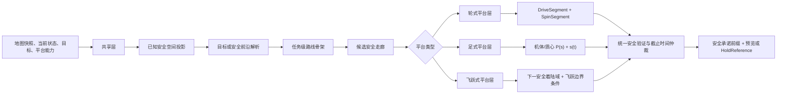

# 多平台路径规划 v3 设计

## 1. 文档状态

- 日期：2026-07-28
- 状态：设计已形成，待用户书面复核
- 适用平台：轮式、足式、飞跃式无人平台
- 实现原则：核心规划链路使用 C++；Python 仅用于离线分析、数据准备、可视化和非实时测试
- 单次路径规划 API 硬时限：小于 `1.0 s`

本文件记录一套独立的多平台路径规划设计。当前阶段只固化接口、算法和验收边界，不授权接入执行器、替换现有默认策略、发布 checkpoint 或启动 canary。

## 2. 目标与非目标

### 2.1 目标

规划器对三类平台提供统一的任务级路线骨架，并产生下一段可以直接交给下游控制器的执行参考：

- 轮式平台：由行驶段和原地旋转段组成的带 `yaw` 机体参考，并为每段提供速度或时序。
- 足式平台：带 `yaw` 的机体/质心几何路径及速度或时序参考。
- 飞跃式平台：单个确定性的下一安全着陆域，以及本次纯弹道飞跃的边界条件。

所有平台共同满足：

1. 硬安全和可达性优先于性能目标。
2. 可行解中优先缩短预计执行时间，其次降低能耗并提高平滑性。
3. 未知区域不能进入执行参考。
4. 每次 API 调用必须在 `1.0 s` 内返回安全结果。
5. 规划超时或新解不可用时，保留已承诺的安全行为，不输出未经验证的路径。

### 2.2 非目标

- 足式规划器不输出落足点、步态、关节轨迹或接触力。
- 轮式规划器不承担底层转矩或轮速闭环控制。
- 飞跃式规划器不输出终端概率分布或信念状态。
- 共享层不求解完整平台动力学。
- 当前设计不包含原始点云建图、定位和状态估计。

## 3. 总体架构

规划器采用“共享层 + 平台层”的分层架构。



共享层描述“从当前位置经哪些已知安全区域接近任务目标”；平台层负责将其变成相应平台可以执行的短时域参考。

## 4. 输入合同

一次规划请求至少包含：

```text
PlanningRequest
├── request_id
├── timestamp
├── platform_type                  # wheeled | legged | hopper
├── current_body_state
│   ├── position = (x, y, z)
│   ├── yaw
│   ├── linear_velocity
│   ├── yaw_rate
│   ├── orientation_quaternion       # hopper 必需
│   └── angular_velocity             # hopper 必需，三轴
├── goal
│   ├── position = (x, y, z)
│   └── optional_yaw
├── immutable_map_snapshot
├── platform_capability
├── previous_committed_reference
└── deadline = request_start + 1.0 s
```

### 4.1 地图快照

规划 API 接收已经维护好的不可变地图快照，至少包含：

- 2.5D 高程或三维占据表达；
- 已知、未知和不可通行状态；
- ESDF 或等价的碰撞距离查询；
- 地图置信度；
- 坡度、粗糙度和局部地面法向；
- 可选语义风险或任务代价。

原始点云配准、融合和全图重建不计入路径规划算法内部。地图系统应在规划调用之间增量维护派生层；规划调用只校验并读取一致性快照。

### 4.2 平台能力

平台能力是共享层和平台层之间的约束合同，至少包含：

- 机体碰撞包络；
- 允许速度、加速度、减速度和 yaw 变化率；
- 坡度、台阶、高差、沟宽和净空能力；
- 机体离地高度区间；
- 允许 roll/pitch 包络；
- 制动和保持能力；
- 轮式平台的差速或滑移转向运动基元版本、`allow_reverse=true` 和 `allow_in_place_spin=true`；
- 轮式平台的最大角速度、角加速度、可选角加加速度，以及原地旋转的坡度、粗糙度、滑移、沉陷和驱动能力边界；
- 飞跃平台的起飞冲量或储能、纯弹道重力模型、独立姿态控制、飞行时间和着陆边界。
- 飞跃平台的三轴最大角速度、最大角加速度、姿态稳定时间和可达性标定表。

## 5. 统一输出合同

### 5.1 公共输出

```text
PlanningResponse
├── status
├── route_skeleton
├── committed_prefix
├── preview
├── platform_reference
├── validity_horizon
├── validation_summary
└── timing_diagnostics
```

其中：

- `route_skeleton` 是任务级路线骨架，只连接当前已知安全空间。
- `committed_prefix` 是下游可继续执行且不能被新规划任意改写的安全前缀。
- `preview` 是尚未承诺、允许下一次调用更新的参考段。
- `platform_reference` 根据平台类型使用不同结构。

### 5.2 轮式分段参考

轮式平台可以原地旋转，因此权威输出是按执行顺序排列的非空分段序列：

```text
WheelReference
└── segments[]
    ├── DriveSegment
    │   ├── time_interval
    │   ├── P(s)
    │   ├── s_of_t
    │   ├── signed_linear_speed
    │   ├── yaw_rate
    │   └── direction             # forward | reverse
    └── SpinSegment
        ├── time_interval
        ├── fixed_position
        ├── yaw_of_t
        ├── yaw_rate
        ├── yaw_acceleration
        └── signed_linear_speed = 0
```

行驶段使用：

\[
P_d(s)=
\begin{bmatrix}
x(s)&y(s)&z(s)&\psi(s)
\end{bmatrix}^{\mathsf T},
\qquad s\in[0,1]
\]

以及单调时间参数化：

\[
s(t),\quad \dot{s}(t),\quad \ddot{s}(t).
\]

由此可恢复：

\[
P_d(t)=P_d(s(t)),\qquad
\dot P_d(t)=P_d'(s)\dot s.
\]

原地旋转段不使用平移弧长参数。它满足：

\[
\boldsymbol p(t)=\boldsymbol p_0,\qquad
\boldsymbol v(t)=\boldsymbol 0,\qquad
\psi(t)=\psi_{\mathrm{spin}}(t).
\]

`signed_linear_speed` 是沿机体前向轴的有符号速度：前进为正、倒车为负，并且必须与 `direction` 一致。所有相邻段在位置、yaw 和绝对时间上连续。与原地旋转段相邻或发生前进/倒车方向切换的行驶段必须在连接边界达到零线速度；角速度和角加速度满足平台能力及下游控制器的接续合同。行驶段采用方向相关的 yaw—切向关系：前进时 yaw 与运动切向一致，倒车时二者相差 \(\pi\)；允许的执行侧滑由标定误差边界覆盖。原地旋转段位置不变、切向未定义，不能强制使用 yaw—切向约束。

不能把原地旋转编码为零长度行驶段，也不能令平移进度 \(s\) 不变而同时把 yaw 表示为多值函数。每一段必须显式包含或可恢复 \(x,y,z,yaw,v,\omega\)。

### 5.3 足式参考

足式平台的权威输出为：

\[
P(s)=
\begin{bmatrix}
x(s)&y(s)&z(s)&\psi(s)
\end{bmatrix}^{\mathsf T},
\qquad s\in[0,1]
\]

以及：

\[
s(t),\quad \dot{s}(t),\quad \ddot{s}(t).
\]

由此可恢复 \(P(t)=P(s(t))\) 和 \(\dot P(t)=P'(s)\dot s\)。路径必须显式包含 `yaw`。roll 和 pitch 不作为精确轨迹输出，而由地面法向、机体高度区间和允许姿态包络约束。

### 5.4 飞跃式参考

飞跃平台的权威输出是单个确定性的凸多边形安全着陆域，而不是单点或终端概率分布：

```text
NextLandingRegion
├── frame_id
├── polygon_xy
├── ground_plane
├── height_residual_bound
├── yaw_interval
├── surface_normal_bounds
└── region_validity
```

同时输出：

```text
JumpBoundary
├── nominal_aim_point
├── nominal_takeoff_velocity
├── takeoff_state_tolerance
├── launch_impulse_or_energy_bounds
├── predicted_landing_footprint
├── flight_time_window
├── zero_translational_control = true
├── gravity_model_id
├── flight_corridor_3d
├── attitude_reorientation_deadline
├── attitude_settle_window
├── landing_velocity_bounds
├── landing_angular_rate_bounds
└── post_landing_hold_condition
```

`nominal_aim_point` 是计算起飞状态的执行参数，不是权威任务目标。`predicted_landing_footprint` 是由确定性状态、模型和执行误差边界传播得到的最坏情况实际落点范围，必须完全包含在 `NextLandingRegion` 内。着陆域描述允许终端集合，不表示概率分布或信念状态。

## 6. 共享层设计

### 6.1 已知安全空间投影

共享层根据平台能力将地图投影为：

1. 硬可行集合；
2. 软代价场；
3. 局部速度上界；
4. 地图未知集合。

硬不可行条件包括碰撞、平台能力越界、地图信息不足和无法安全制动。软代价包括预计执行时间、风险、能耗、转向和地形不平整程度。

学习模型只能提供可通行性评分、运动代价或候选排序；几何碰撞、能力边界、未知区域和最终安全验证必须由解析规则控制。

### 6.2 目标和安全前沿解析

- 目标位于已知安全连通域：路线骨架指向目标。
- 目标位于未知区域或被未知区域隔开：路线骨架只到达朝向目标的当前已知安全前沿。
- 执行参考不能越过该前沿。
- 未知尾段以 `unresolved_tail` 标记，不生成猜测路径。

### 6.3 任务级路线骨架

共享层使用多分辨率、带严格时间预算的 ARA* 搜索。搜索代价按以下优先级构造：

\[
J =
\begin{cases}
+\infty, & \text{硬安全或可达性不满足},\\
\hat T+\lambda_E E+\lambda_S S+\lambda_R R, & \text{可行}.
\end{cases}
\]

其中：

- \(\hat T\)：预计执行时间，为主要性能目标；
- \(E\)：能耗代理；
- \(S\)：平滑性代价；
- \(R\)：非致命风险或低置信度代价。

ARA* 先产生一个可行骨架，在剩余预算内降低次优界。达到截止时间时返回当前最好且已验证的候选。

共享层提供同一个有界 ARA* 搜索引擎和通用代价合同，平台通过状态定义和邻接生成器实例化该搜索，而不是先运行一个完整二维全局搜索、再串行运行第二个平台全局搜索。轮式平台使用 SE(2) 状态格点；足式平台使用 SE(2.5D) 姿态格点；飞跃式平台使用着陆域图。二维障碍感知 cost-to-go 可以作为轮式搜索的启发式或粗分辨率缓存，但不是独立的权威执行路线。

### 6.4 安全走廊

沿路线骨架建立有序走廊窗口。共享层提供初始几何走廊，平台层再按具体运动能力收紧。

对二维或 2.5D 路段，使用：

1. 在硬安全连通域内从骨架种子进行区域生长；
2. 使用 ESDF 限制横向扩张；
3. 将局部自由区域近似为凸半空间；
4. 附加高度、yaw、地面法向和速度上界。

单个走廊段表示为：

\[
\mathcal C_k=
\left\{
(x,y,z,\psi):
A_k[x,y]^{\mathsf T}\le b_k,\;
z_k^-\le z\le z_k^+,\;
\psi_k^-\le\psi\le\psi_k^+
\right\}.
\]

三维飞行段使用凸多面体或等价的三维安全管道。

轮式原地旋转段不构造具有平移方向的走廊，而是构造固定中心、给定 yaw 区间内的连续旋转扫掠约束。该约束必须覆盖非圆形机体在整个旋转过程中的占据区域，并同时满足地面支撑和原地转向能力边界。

## 7. 轮式平台层

### 7.1 运动模型与边界

轮式平台按差速或滑移转向平台建模：

\[
q=(x,y,\psi,d,m),
\]

其中 \(d\) 表示前进或后退方向，\(m\) 表示上一运动模式，用于计算方向和模式切换代价。平台允许前进、倒车、弧线转向和原地旋转，但不允许横向平移。地面高度 \(z\) 以及约束用 roll/pitch 由机体足迹下的地形拟合得到，不作为独立搜索维度。名义控制满足：

\[
\dot x=v\cos\psi,\qquad
\dot y=v\sin\psi,\qquad
\dot\psi=\omega.
\]

其中 \(v\) 是有符号机体系前向速度。原地旋转对应 \(v=0,\omega\ne0\)。对滑移转向平台，这只是标定后的规划运动抽象，不等价于无误差轮地动力学；实际侧滑、转向中心偏移和沉陷通过运动基元标定、确定性跟踪误差包络、地形能力阈值和最终连续验证处理。

### 7.2 SE(2) 状态格点搜索

轮式平台将共享 ARA* 实例化为 SE(2) 状态格点搜索，而不是在共享搜索之后再串行执行第二次全局搜索。运动基元在离线生成或标定，在线只执行变换、代价查询和连续碰撞检查。最小基元集包括：

- 前进直线和不同曲率的前进圆弧；
- 倒车直线和倒车圆弧；
- 固定 yaw 增量的原地左转和右转；
- 经标定后可选的低能耗大半径转向基元。

每条格点边必须满足：

- 完整机体扫掠无碰撞且不进入未知区域；
- 坡度、高差、沟槽、净空、roll/pitch 和静态稳定裕度有效；
- 地面支撑、制动距离和轮地能力边界有效；
- 预计滑移、沉陷和跟踪误差不超过确定性阈值；
- 原地旋转边在全部中间 yaw 上通过旋转扫掠和支撑检查。

边代价为：

\[
\begin{aligned}
J_{\mathrm{edge}}={}&
\hat T+
\lambda_EE+
\lambda_{\mathrm{slip}}R_{\mathrm{slip}}+
\lambda_{\mathrm{spin}}I_{\mathrm{spin}}\\
&+
\lambda_{\mathrm{rev}}I_{\mathrm{reverse}}+
\lambda_{\mathrm{switch}}I_{\mathrm{switch}}+
\lambda_CC_{\mathrm{clearance}}.
\end{aligned}
\]

原地旋转是允许动作，但不是默认的零代价捷径。只有旋转扫掠、支撑、坡度、粗糙度、滑移、沉陷和驱动能力全部合格时才能展开；在可行候选中，对原地旋转施加能耗、土壤扰动和模式切换代价，使规划器优先选择安全且代价更低的连续圆弧。

搜索同时使用障碍感知二维 cost-to-go 和运动学时间下界。启发式不得把未知区域当作可通行捷径；为了保持 ARA* 次优界语义，组合后的基础启发式必须是当前边代价的下界，再由 ARA* 的显式膨胀系数加速搜索。

### 7.3 分段执行参考

格点结果先按运动模式切分为 `DriveSegment` 和 `SpinSegment`。连续行驶基元组成的 `DriveSegment` 在共享走廊内拟合三次 B 样条，并通过固定轮数的序列凸规划优化控制点。

目标函数包括：

\[
J_{\mathrm{wheel}}=
w_T\hat T+
w_L L+
w_\kappa J_\kappa+
w_\psi J_\psi+
w_CJ_{\mathrm{clearance}}.
\]

硬约束包括：

- 机体扫掠体位于安全走廊；
- 曲率、线速度与角速度耦合边界；
- 与前进/倒车方向一致的 yaw—路径切向关系；
- 坡度、侧倾和净空限制；
- 起点状态连续；
- 已承诺前缀保持不变。

若 B 样条或 SCP 未在预算内得到完整认证结果，则保留已经通过验证的格点行驶基元，不发布部分优化结果。平滑器不能在未经重新搜索与完整认证的情况下删除、插入或移动原地旋转段。

`SpinSegment` 保持名义 \(x,y,z\) 不变，使用内部连续的展开 yaw 表示和单调 yaw 轨迹完成离散 yaw 状态之间的旋转，避免在 \(-\pi/\pi\) 处产生跳变。实际中心漂移由确定性跟踪误差包络覆盖。旋转前后的行驶段在线速度为零处连接。原地旋转的机体包络不是中心点，而是非圆形足迹在 yaw 区间上的并集。

### 7.4 速度和时序

行驶段使用 TOPP-RA 类前向—后向时间参数化，根据路径曲率、坡度、侧倾风险、轮地能力、局部净空和制动距离计算 \(s(t)\)。局部线速度上界至少满足：

\[
v_{\max}(s)\le
\min\left(
v_{\mathrm{terrain}},
\frac{\omega_{\max}}{|\kappa|},
\sqrt{\frac{a_{\mathrm{lat,max}}}{|\kappa|}},
v_{\mathrm{traction}},
v_{\mathrm{brake}}
\right),
\]

其中零曲率项按无限制处理，所有上界使用经过安全裕度收紧的确定性值。前向传播施加加速和牵引约束，后向传播施加减速、停止位置和已知空间内可停车约束。

原地旋转段独立生成梯形或受限 S 曲线 yaw 时序：

\[
|\dot\psi|\le\omega_{\max},\qquad
|\ddot\psi|\le\alpha_{\max},\qquad
|\dddot\psi|\le j_{\psi,\max}
\]

其中角加加速度约束只在平台能力提供时启用。坡度、松散地形或高转向阻力可以收紧角速度和角加速度。相邻分段使用统一绝对时间轴，并满足位置、yaw、线速度以及合同要求的角速度连续性。

### 7.5 连续验证与降级

输出前必须执行：

- 行驶段机体扫掠的自适应连续碰撞验证；
- 原地旋转段对全部 yaw 区间的旋转扫掠验证；
- 行驶和旋转全过程的地面支撑、稳定性、滑移和沉陷边界验证；
- 分段连接处的姿态、速度和制动能力验证；
- 承诺前缀在当前地图快照和能力版本下仍然有效的复核。

全部扫掠检查必须使用机体碰撞包络，并进一步膨胀确定性的定位、跟踪、侧滑和旋转中心漂移误差。离散状态或采样点通过但采样点之间发生碰撞的参考不能发布。若新的完整分段序列不可用，则返回旧的有效承诺前缀或包含线速度、角速度安全制动的 `HoldReference`。

## 8. 足式平台层

### 8.1 设计边界

足式平台只生成带 `yaw` 的机体/质心路径和时序。落足、步态、摆腿轨迹、接触力和关节控制由下游运动控制器负责。

### 8.2 足式可通行性场

在高程图上维护与机体航向相关的可通行性场：

\[
T_{\mathrm{leg}}(x,y,\psi).
\]

硬不可行条件包括：

- 机体包络与地形碰撞；
- 坡度超过平台能力；
- 地形高差或粗糙度超过能力；
- 可支撑地面比例不足；
- 沟宽或跨越距离超过能力；
- 允许机体高度区间为空；
- 地图置信度不足；
- 预计 roll/pitch 超出包络。

软代价使用：

\[
c=
w_t\hat t+
w_rR+
w_sC_{\mathrm{slope}}+
w_qC_{\mathrm{rough}}+
w_\psi C_{\mathrm{turn}}.
\]

预计执行时间为主要项。可选的学习运动代价或下游控制器价值只参与软排序，不单独授予安全资格。

### 8.3 足式路线骨架

足式平台将共享层的 ARA* 骨架搜索实例化为 SE(2.5D) 姿态格点搜索，而不是在共享搜索之后再串行执行第二次搜索：

\[
q=(x,y,\psi),\qquad
z=h(x,y)+h_{\mathrm{body}}.
\]

搜索动作是平台能力允许的前进、侧移和转向机体运动基元。状态中显式搜索 \(x,y,yaw\)，高度从局部地面和允许机体高度区间确定。

恢复的骨架节点为：

\[
Q_i=(x_i,y_i,z_i,\psi_i).
\]

### 8.4 足式安全走廊

沿骨架分窗处理：

1. 在硬可行姿态格点中进行连通区域生长；
2. 用 ESDF 和机体碰撞包络限制扩张；
3. 根据局部地面平面确定 \(z\) 区间；
4. 根据法向、坡度和转向能力确定 yaw 区间；
5. 将安全格点近似为有序局部凸约束。

该走廊允许表达“某位置只能以特定航向通过”以及“可以跨越但不适合机体中心停留”等足式能力差异。

### 8.5 足式执行参考

在安全走廊内优化：

\[
P(s)=
\begin{bmatrix}
x(s)&y(s)&z(s)&\psi(s)
\end{bmatrix}^{\mathsf T}.
\]

使用三次 B 样条和固定 `2–4` 轮 SCP，目标函数为：

\[
J_{\mathrm{leg}}=
w_T\hat T+
w_L L+
w_\kappa J_\kappa+
w_\psi J_\psi+
w_CJ_{\mathrm{clearance}}.
\]

约束包括：

- 路径位于足式安全走廊；
- 机体高度区间非空；
- yaw 变化率和等效曲率受限；
- roll/pitch 估计处于允许包络；
- 起点状态连续；
- 已承诺前缀不变；
- 下游控制器提供的速度和可执行能力上界。

在优化后的路径上执行受限前向—后向速度传播，得到 \(s(t)\)、\(\dot s(t)\) 和 \(\ddot s(t)\)。速度上限同时取决于坡度、粗糙度、曲率、地图置信度和下游运动控制器上报的能力包络。

### 8.6 下游合同

下游足式运动控制器负责：

- 根据机体/质心参考生成落足和步态；
- 求解接触力、摆腿和全身动力学；
- 跟踪 `P(s)+s(t)`；
- 向规划器回报当前可执行速度、坡度、跨越和姿态能力；
- 在无法继续跟踪时请求减速、重规划或保持。

## 9. 飞跃式平台层

### 9.1 动力学边界

飞跃式平台采用“质心平移纯弹道、机体姿态独立受控”的解耦模型：

- 平台离地后不再施加改变质心轨迹的平移控制；
- 质心轨迹完全由起飞位置、起飞速度和已声明重力模型决定；
- 姿态执行器可以在不改变质心弹道的前提下调整 yaw、对地姿态和着陆角速度；
- 所有新的着陆域、名义瞄准点和起飞状态必须在起飞前完成认证。

月面局部飞跃使用恒定重力模型：

\[
p(t)=p_0+v_0t+\frac12gt^2,\qquad
v(t)=v_0+gt.
\]

对给定内部名义瞄准点 \(p_a\) 和飞行时间 \(T\)，所需名义起飞速度与着陆速度分别为：

\[
v_0(T)=\frac{p_a-p_0}{T}-\frac12gT,
\qquad
v_f(T)=\frac{p_a-p_0}{T}+\frac12gT.
\]

若局部恒定重力模型的有效范围、飞行时间或高度边界不满足，则该候选不可发布；在线默认方法不使用动力飞行 SCvx、SOCP 或完整六自由度轨迹优化。

### 9.2 安全着陆域生成

共享层在路线骨架前方生成已知、感知可信且任务有效的安全着陆掩码。平台层计算：

\[
\mathcal L_{\mathrm{terrain}} =
\mathcal L_{\mathrm{known}}
\cap
\mathcal L_{\mathrm{slope}}
\cap
\mathcal L_{\mathrm{roughness}}
\cap
\mathcal L_{\mathrm{footprint}}
\cap
\mathcal L_{\mathrm{stable}}
\cap
\mathcal L_{\mathrm{mission}}.
\]

其中：

- `known`：着陆足迹覆盖范围内不存在未知栅格；
- `slope`：局部地面法向处于允许着陆姿态包络；
- `roughness`：平面拟合残差和局部高差处于边界内；
- `footprint`：按机体着陆足迹和安全余量腐蚀后仍可用；
- `stable`：落地后能够静止保持并具备后续规划或再次起飞条件；
- `mission`：位于当前任务级路线骨架允许的前进区域。

在安全掩码上执行：

1. 欧氏距离变换，寻找高净空种子；
2. 安全栅格连通区域生长；
3. 仅当新增栅格形成的凸包及着陆足迹仍完全位于安全掩码内时接受扩张；
4. 将凸包向内简化为固定顶点上限的凸多边形；
5. 为该多边形绑定局部地面平面、高度残差、法向包络和 wrap-aware yaw 区间。

权威着陆域表示为：

\[
\mathcal L =
\left\{
(x,y,z,\psi):
A
\begin{bmatrix}
x\\y
\end{bmatrix}
\le b,\;
|z-\hat h(x,y)|\le\varepsilon_z,\;
\psi\in[\psi^-,\psi^+]
\right\}.
\]

直接对非凸连通域求凸包可能跨过内部危险区，因此禁止未经逐栅格安全复核的凸包扩张。一次响应只发布一个凸着陆域，不发布多个不相连区域的并集。

### 9.3 着陆域图与任务路线

飞跃式平台将共享层 ARA* 骨架搜索实例化为着陆域图搜索，而不是在共享搜索之后再串行执行第二次全局搜索：

- 源节点是当前稳定保持域或由当前已承诺起飞状态构造的虚拟节点；
- 图节点是确定性安全着陆域；
- 图边表示存在从当前节点到下一节点的已知安全纯弹道飞跃；
- 边主代价为预计飞行时间；
- 次代价依次为起飞冲量或储能、着陆裕度、飞行净空和与后续路线的一致性。

搜索采用惰性 ARA*：

1. 使用最大跳距、飞行时间下界和起飞能力包络进行廉价边筛选；
2. 只对可能进入当前最好路线的边执行精确弹道认证；
3. 下一跳必须完整认证；
4. 后续着陆域只作为任务级路线骨架，可以在下次规划更新；
5. 目标位于未知区时，路线只到达当前已知安全着陆前沿。

### 9.4 名义瞄准点与飞行时间求解

规划器在着陆域内部选择名义瞄准点用于计算起飞速度，但该点不改变着陆域的权威性。首先计算着陆域的切比雪夫中心或最大内切圆中心，作为高裕度候选：

\[
p_{\mathrm{clear},xy}=
\arg\max_{p\in\Pi_{xy}(\mathcal L)}
d\!\left(p,\partial\Pi_{xy}(\mathcal L)\right).
\]

固定数量的确定性瞄准点集合还可以包含沿任务前进方向的内缩极值点和其他通过最坏情况落点包含检查的点。切比雪夫中心的高净空偏好不凌驾于“飞行时间优先”的目标；所有安全候选仍按最小可行飞行时间统一排序，净空仅作为后续比较项。瞄准点的 \(z\) 由局部地面平面确定，目标 yaw 从着陆域的允许区间中独立选择。

对每个着陆域，在线连续优化变量仅为飞行时间 \(T\)。将起飞能力、弹道高度、着陆速度和飞行时间约束写成：

\[
F_i(T)\le0,\qquad T_{\min}\le T\le T_{\max}.
\]

使用解析边界、固定迭代上限的区间求根或 Brent 法求全部可行时间段。硬约束通过后，选择最小安全可行飞行时间；时间相同时依次比较起飞能量、着陆裕度和走廊净空。

瞄准点候选数必须有硬上限，线程完成顺序不得改变最终选择。

### 9.5 连续弹道碰撞与走廊认证

对每条候选弹道：

1. 使用二维栅格 DDA 枚举水平投影经过的全部地图单元；
2. 求弹道在每个单元对应时间区间内的最低高度；
3. 与该单元的保守最大地形高度、地图误差和机体扫掠包络比较；
4. 在起飞、最高点、地形突变和着陆邻域自适应细分；
5. 将通过验证的扫掠体膨胀结果保存为时间有序的 `flight_corridor_3d`。

固定时间间隔的离散采样不能单独证明连续无碰撞。弹道任一段进入未知空间、穿越障碍膨胀体或失去规定净空时，该边不可发布。

### 9.6 姿态可达性认证

目标姿态由着陆面法向、允许 yaw 区间和着陆角速度边界确定。设起始与目标四元数为 \(q_0,q_f\)，最短旋转角为：

\[
\theta =
2\arccos\left(\left|q_0^{\mathsf T}q_f\right|\right).
\]

使用保守最大角速度 \(\omega_{\max}\) 和最大角加速度 \(\alpha_{\max}\) 计算静止到静止的最短姿态调整时间：

\[
T_{\mathrm{att}}=
\begin{cases}
2\sqrt{\theta/\alpha_{\max}},
&\theta\le\omega_{\max}^2/\alpha_{\max},\\[2mm]
2\omega_{\max}/\alpha_{\max}
+
\dfrac{\theta-\omega_{\max}^2/\alpha_{\max}}{\omega_{\max}},
&\text{其他}.
\end{cases}
\]

实际三轴耦合和执行器限制可以通过离线标定的姿态可达时间表进一步收紧。候选必须满足：

\[
T_{\mathrm{flight}}
\ge
T_{\mathrm{att}}+
T_{\mathrm{settle}}+
T_{\mathrm{guard}}.
\]

飞行末段的 `attitude_settle_window` 只用于降低角速度并稳定着陆姿态，不再安排大幅 yaw 调整。

### 9.7 确定性落点范围与最终认证

着陆域是允许终端集合，不是概率分布。起飞状态、重力和地图误差按声明的确定性边界传播：

\[
\delta p(T)
=
\delta p_0+
T\delta v_0+
\frac12T^2\delta g.
\]

由此得到最坏情况 `predicted_landing_footprint`。完整认证必须满足：

\[
\mathcal E_{\mathrm{landing}}
\subseteq
\mathcal L_{\mathrm{cert}},
\]

其中：

\[
\mathcal L_{\mathrm{cert}}=
\mathcal L_{\mathrm{terrain}}
\cap
\mathcal L_{\mathrm{ballistic}}
\cap
\mathcal L_{\mathrm{attitude}}
\cap
\mathcal L_{\mathrm{future}}.
\]

\(\mathcal L_{\mathrm{future}}\) 表示落地后能够稳定保持，并在非终局目标下至少存在一条通往后续已知安全着陆域或安全前沿的候选边；到达最终任务目标时只要求安全保持。

公共 `NextLandingRegion` 必须来自最终的 \(\mathcal L_{\mathrm{cert}}\)，不能直接发布尚未经过弹道、姿态和后续可达性收紧的 \(\mathcal L_{\mathrm{terrain}}\)。若最终交集非凸或包含多个连通分量，只选择一个连通分量，并使用第 9.2 节的逐栅格复核方法向内生成单个保守凸多边形。

最终按以下顺序选择并发布单个着陆域：

1. 硬安全、弹道可达和误差包含关系成立；
2. 预计飞行时间最短；
3. 起飞冲量或储能较少；
4. 着陆域和弹道走廊裕度较大；
5. 与后续路线骨架一致。

若没有完整认证的着陆域，则不发布新的飞跃边界。平台已经起飞后，规划层不得重新指定质心落点或中断已承诺弹道，只能由姿态控制器继续满足已承诺着陆域和姿态边界，并更新落地后的保持或后续任务建议。

## 10. 安全承诺、预览与降级

### 10.1 安全承诺前缀

每次响应将参考分为：

- `committed_prefix`：已经验证并授权执行的短段；
- `preview`：用于下游预瞄但尚未不可撤销承诺的后续段。

新规划必须从旧的承诺边界连续接续，不能在执行中瞬间改变已承诺路径、速度、飞跃着陆域或名义起飞边界。

### 10.2 HoldReference

如果无法在截止时间内得到新的完整安全结果：

- 静止平台：保持当前位置和 yaw。
- 运动中的轮式平台：执行已验证的线速度和角速度制动轨迹，然后保持。
- 运动中的足式平台：执行已验证的制动轨迹，然后保持。
- 已起飞平台：继续已承诺飞行，完成着陆后保持。

不得以未经验证的部分优化结果替代 `HoldReference`。

## 11. C++ 核心实现

### 11.1 范围

下列实时热路径全部使用 C++ 实现：

- 地图快照查询和增量派生层缓存；
- 平台能力投影；
- 目标/安全前沿解析；
- ARA*、轮式 SE(2) 状态格点和足式姿态格点搜索；
- 安全走廊生成；
- 轮式行驶/原地旋转分段与旋转扫掠生成；
- 确定性安全着陆域提取和保守凸化；
- 纯弹道飞行时间解析求解与连续弧段验证；
- 姿态可达时间和最坏情况落点范围认证；
- B 样条与 SCP；
- QP 求解器适配；
- 路径时间参数化；
- 连续碰撞和能力验证；
- 截止时间仲裁与安全降级；
- 响应序列化前的合同校验。

Python 不进入单次规划调用的关键路径。

### 11.2 工程约束

- 推荐使用 C++20。
- 使用 `std::chrono::steady_clock` 传播绝对截止时间。
- 每个主要模块接收剩余预算并支持提前返回当前最好候选。
- 热路径使用预分配内存、对象池和固定容量工作区，避免不可控分配。
- 地图快照只读，规划线程不持有建图写锁。
- 稀疏矩阵结构和 QP 工作区尽量复用。
- 可选学习代价通过有界推理接口接入；超时或模型不可用时退回解析代价。
- 传输层可以是进程内调用或 RPC，但不能改变安全、截止时间和输出语义。

### 11.3 并发

允许并行执行互不依赖的候选评估，例如：

- 多走廊候选验证；
- 轮式状态格点候选边的扫掠和地形能力检查；
- 飞跃着陆域和惰性弹道边可行性检查；
- 不同局部窗口的几何预计算。

共享的最终仲裁器必须保持确定性：相同地图快照、请求和配置应产生相同排序结果；线程完成顺序不得改变安全结论。

## 12. 单次调用时延合同

### 12.1 时限定义

`<1.0 s` 指规划 API 从接收一致性请求到返回完整响应的墙钟时间。原始传感器建图不属于规划调用，但请求解析、地图快照校验、规划、验证和响应封装均计入。

API 的硬保证是“按时返回安全结果”，不是“任何场景都按时发现一条全新的完整路径”。

### 12.2 轮式平台参考预算

| 环节 | 典型预算 |
|---|---:|
| 轮式可通行性与代价层增量读取 | `20–60 ms` |
| SE(2) 状态格点 ARA* | `60–250 ms` |
| 行驶/原地旋转分段与走廊生成 | `20–80 ms` |
| B 样条与固定轮数 SCP | `40–160 ms` |
| 行驶段前后向时序化与旋转段 yaw 时序 | `3–15 ms` |
| 行驶和旋转连续扫掠复核 | `20–80 ms` |
| 调度、封装和安全余量 | `100–200 ms` |

典型总时延目标为 `250–600 ms`。复杂场景可以使用到 `900–950 ms`，之后必须进入截止时间降级。各环节预算用于截止时间分配，并不要求串行占满其上界；缓存查询、候选检查和局部几何预计算可以在确定性仲裁下并行。

### 12.3 足式平台参考预算

| 环节 | 典型预算 |
|---|---:|
| 足式可通行性增量读取/更新 | `20–80 ms` |
| SE(2.5D) ARA* | `120–300 ms` |
| 安全走廊生成 | `30–100 ms` |
| B 样条与固定轮数 SCP | `80–250 ms` |
| 前向—后向时序化 | `2–10 ms` |
| 连续安全复核 | `20–80 ms` |
| 调度、封装和安全余量 | `100–200 ms` |

典型总时延目标为 `350–750 ms`。复杂场景可以使用到 `900–950 ms`，之后必须进入截止时间降级。

### 12.4 飞跃式平台参考预算

| 环节 | 典型预算 |
|---|---:|
| 安全着陆掩码读取与着陆域提取 | `20–80 ms` |
| 着陆域图惰性 ARA* | `40–180 ms` |
| 飞行时间解析求解与起飞状态筛选 | `10–60 ms` |
| 连续弹道碰撞与走廊认证 | `20–100 ms` |
| 姿态可达性与最坏情况落点认证 | `5–30 ms` |
| 仲裁、封装和安全余量 | `100–200 ms` |

纯弹道飞跃规划的典型总时延目标为 `150–450 ms`，复杂场景尾部目标小于 `750 ms`。它不运行在线 SCvx、SOCP 或完整六自由度轨迹优化；着陆域数、图边数、瞄准点数、区间求根次数和连续验证细分数均必须有硬上限。

### 12.5 硬截止调度

建议按绝对时间点执行：

```text
0–80 ms      快照校验和增量可通行性处理
80–350 ms    路线骨架搜索，始终保留当前最好可行解
350–450 ms   安全走廊构造
450–750 ms   平台执行参考生成或纯弹道认证
750–850 ms   时序化和连续验证
850–950 ms   最终验证、封装或降级
950 ms       强制停止新计算
1000 ms      API 返回硬边界
```

任何模块不能以“等待收敛”为结束条件；搜索扩展数、SCP 轮数、候选数和验证采样上限都必须有界。

## 13. 返回状态

建议至少定义：

- `SUCCESS`：新路线和执行参考全部通过验证。
- `SAFE_PARTIAL`：只更新了已知安全范围内的承诺前缀或预览。
- `HOLD`：没有可发布的新参考，返回安全制动/保持。
- `NO_KNOWN_SAFE_ROUTE`：当前已知地图中不存在安全连通路线。
- `INVALID_REQUEST`：输入合同不满足，仍返回可用的旧承诺或保持指令。

超时原因、各模块耗时、候选数量、搜索扩展数量和降级原因写入诊断字段，但诊断字段不能影响权威执行语义。

## 14. 验证与验收

### 14.1 合同验证

- 轮式权威输出是只含 `DriveSegment` 和 `SpinSegment` 的有序非空序列。
- 轮式行驶段可恢复 \(x,y,z,yaw,v,\omega\)，原地旋转段保持位置不变且线速度为零。
- 轮式行驶段的有符号线速度与 `direction` 一致，前进/倒车切换和原地旋转边界处线速度为零。
- 足式输出包含 \(x,y,z,yaw\) 的 \(P(s)+s(t)\)。
- 足式输出不包含落足、步态、接触力或关节命令。
- 飞跃式权威输出只有一个确定性凸多边形安全着陆域，不是单点、概率分布或多个不相连区域的并集。
- 飞跃式名义瞄准点只作为执行参数，不能替代权威着陆域。
- 未知区域不进入执行参考。
- 所有输出明确区分承诺前缀和预览。

### 14.2 安全验证

- 路线骨架所有节点位于平台硬可行集合。
- 连续路径扫掠体位于安全走廊。
- 轮式每条状态格点边均通过完整机体扫掠和地形能力检查。
- 轮式原地旋转在全部中间 yaw 上无碰撞，且满足支撑、坡度、粗糙度、滑移、沉陷和驱动能力边界。
- 轮式行驶段满足方向相关的 yaw—切向关系；原地旋转段不应用 yaw—切向约束。
- 轮式分段连接处的位置、yaw、时间和规定速度分量连续。
- 速度和制动距离满足平台能力。
- 机体高度和 roll/pitch 包络有效。
- 飞跃质心轨迹满足零平移控制的纯弹道模型，姿态控制不改变质心轨迹。
- 飞跃弹道连续无碰撞，姿态在飞行时间内可达并留有稳定窗口。
- 最坏情况 `predicted_landing_footprint` 完全包含在权威安全着陆域内。
- 超时、求解失败和模型不可用均能返回安全降级结果。

### 14.3 性能验证

在声明的地图尺寸、分辨率、yaw 离散数、候选上限和硬件基线上：

- 每次 API 调用墙钟时间严格小于 `1.0 s`；
- 典型调用目标小于 `750 ms`；
- `950 ms` 前停止新搜索和优化；
- 无未界定迭代、无限候选生成或无截止时间外部调用；
- 延迟测试同时覆盖成功、无路、未知目标、窄通道、轮式倒车、轮式原地旋转、求解失败和降级路径。

### 14.4 确定性和可复现性

- 固定输入和配置时，候选排序、状态码和权威参考可复现。
- 学习代价失效时，解析基线仍可独立运行。
- 每次响应记录地图快照版本、能力版本、配置版本和计时诊断。

## 15. 设计依据

以下工作为轮式层的算法选择提供了直接依据：

- [Efficient Constrained Path Planning via Search in State Lattices](https://www.cs.cmu.edu/~alonzo/pubs/papers/isairas05Planning.pdf)：用离线可行运动基元和在线启发式搜索表达受运动约束的行星 rover 路径。
- [ARA*: Anytime A* with Provable Bounds on Sub-Optimality](https://proceedings.neurips.cc/paper/2003/file/ee8fe9093fbbb687bef15a38facc44d2-Paper.pdf)：在严格时间预算内先求可行解、再复用搜索结果逐步收紧次优界。
- [A New Approach to Time-Optimal Path Parameterization Based on Reachability Analysis](https://arxiv.org/abs/1707.07239)：基于可达集前后向传播的快速、鲁棒路径时序化。
- [Online Trajectory Optimization Based on Timed Elastic Bands](https://rst.etit.tu-dortmund.de/en/research/robotics/online-trajectory-optimization-based-on-timed-elastic-ban/)：联合空间与时间的稀疏局部轨迹优化依据；本设计只把这类方法作为可选局部修正，不承担单独的权威安全认证。
- [Terrain Adaptive Navigation for Planetary Rovers](https://www-robotics.jpl.nasa.gov/media/documents/ROB-08-0042.pdf)：行星 rover 的地形分类、滑移预测、路径规划和滑移补偿分层依据。
- [Experimental Validation of Energy-Optimal Turning Radii for Skid-Steer Rovers](https://users.encs.concordia.ca/~kskoniec/publication/effati2021experimental/)：原地旋转能耗较高、连续圆弧在硬地和沙地上通常更节能的实验依据。
- [Nav2 Smac Planner](https://docs.ros.org/en/ros2_packages/humble/api/nav2_smac_planner/index.html)：C++ SE(2) Hybrid A*/状态格点的工程结构、原地旋转基元和百毫秒级规划性能参考；具体时延仍须在本项目硬件与地图上重新基准测试。

以下工作为足式层的算法选择提供了直接依据：

- [ArtPlanner: Robust Legged Robot Navigation in the Field](https://arxiv.org/abs/2303.01420)：有界计算时间的姿态采样、可达性抽象和学习运动代价。
- [Planning and Execution of Dynamic Whole-Body Locomotion for a Hydraulic Quadruped on Challenging Terrain](https://arxiv.org/abs/1904.03695)：ARA* 粗机体路径与局部落足/机体轨迹分层。
- [Humanoid Path Planning over Rough Terrain using Traversability Assessment](https://arxiv.org/abs/2203.00602)：2.5D 地形可通行性 A* 与后续连续平滑。
- [Perceptive Locomotion through Nonlinear Model Predictive Control](https://arxiv.org/abs/2208.08373)：可落足分类、平面分割、距离场和下游在线 NMPC。
- [STEP: Stochastic Traversability Evaluation and Planning for Risk-Aware Off-road Navigation](https://www.roboticsproceedings.org/rss17/p021.html)：可通行性风险评估和 SQP-MPC。
- [Learning Forward Dynamics Model and Informed Trajectory Sampler for Safe Quadruped Navigation](https://www.roboticsproceedings.org/rss18/p069.html)：粗全局路径与局部速度规划的分层接口。

以下工作为飞跃式层的算法选择提供了直接依据：

- [Motion Planning on an Asteroid Surface with Irregular Gravity Fields](https://arxiv.org/abs/1902.02065)：使用弹道动力学、Lambert 边值问题和射击法求目标拦截所需起飞速度。
- [Hopping Trajectory Planning for Asteroid Surface Exploration Accounting for Terrain Roughness](https://www.jstage.jst.go.jp/article/tjsass/64/4/64_T-20-54/_pdf)：考虑多面体地形、碰撞和地形粗糙度的飞跃轨迹设计。
- [Lidar-Based Hazard Avoidance for Safe Landing on Mars](https://www-robotics.jpl.nasa.gov/media/documents/aejJGCD2002.pdf)：基于坡度、粗糙度、着陆足迹膨胀和安全代价图的着陆区选择。
- [SpaceHopper: A Small-Scale Legged Robot for Exploring Low-Gravity Celestial Bodies](https://arxiv.org/abs/2403.02831)：低重力飞行阶段独立姿态重定向和受控着陆的实验依据。

## 16. 已确定事项与待标定参数

### 16.1 已确定

- 使用共享层加平台层。
- 核心规划链路使用 C++。
- 轮式平台按差速或滑移转向建模，允许前进、倒车和原地旋转，但不允许横向平移。
- 轮式共享 ARA* 实例化为带原地旋转基元的 SE(2) 状态格点搜索。
- 轮式权威输出为有序 `DriveSegment + SpinSegment` 序列。
- 轮式行驶段使用 \(P(s)+s(t)\)，原地旋转段使用固定位置和独立 yaw 时序。
- 原地旋转必须通过整个 yaw 变化区间的扫掠和地形能力认证，并施加能耗、滑移、沉陷和模式切换代价。
- 足式权威输出为机体/质心 \(P(s)+s(t)\)。
- 足式只输出机体/质心参考。
- 路径状态包含 `yaw`。
- 飞跃式质心平移采用纯弹道，飞行中无平移控制，姿态可以独立调整。
- 飞跃式权威输出为单个确定性凸多边形安全着陆域。
- 名义瞄准点和名义起飞速度只作为 `JumpBoundary` 执行参数。
- 最坏情况落点范围必须完全包含于权威着陆域。
- 目标未知时只规划到已知安全前沿。
- 硬安全优先；可行候选中执行时间优先。
- 单次 API 硬时限小于 `1.0 s`。
- 超时使用安全承诺前缀和 `HoldReference`。

### 16.2 实现前待标定

- 地图分辨率和局部规划窗口；
- yaw 离散数量和各平台运动基元；
- 轮式前进/倒车速度边界、原地旋转 yaw 步长、角速度、角加速度和可选角加加速度边界；
- 轮式倒车、原地旋转以及运动模式切换的时间和能耗代价；
- 轮式连续圆弧的能耗最优转弯半径，以及原地旋转的能耗、滑移、沉陷、坡度、粗糙度和驱动能力阈值；
- 承诺前缀与预览的长度或时间范围；
- ARA* 扩展上限和初始次优系数；
- 每类平台的走廊窗口数量；
- SCP 控制点数量、轮数和稀疏 QP 求解器；
- 连续验证的自适应细分阈值；
- 飞跃着陆域最大顶点数、区域生长范围和瞄准点候选上限；
- 局部恒定重力模型的有效距离、高度和飞行时间范围；
- 起飞速度、冲量或储能边界以及三轴姿态控制能力；
- 起飞状态、重力、地图和执行误差的确定性边界；
- 各平台能力参数及下游控制器回报频率。

这些参数需要通过目标硬件上的基准测试确定，但不改变本文件规定的接口、分层和安全语义。
