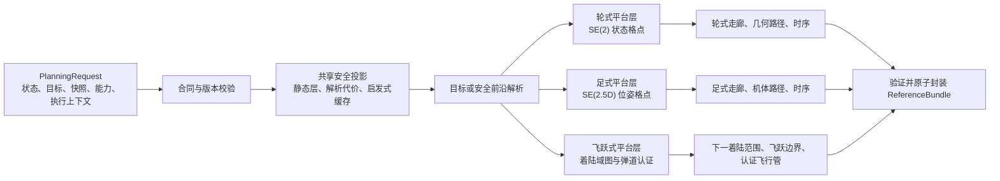
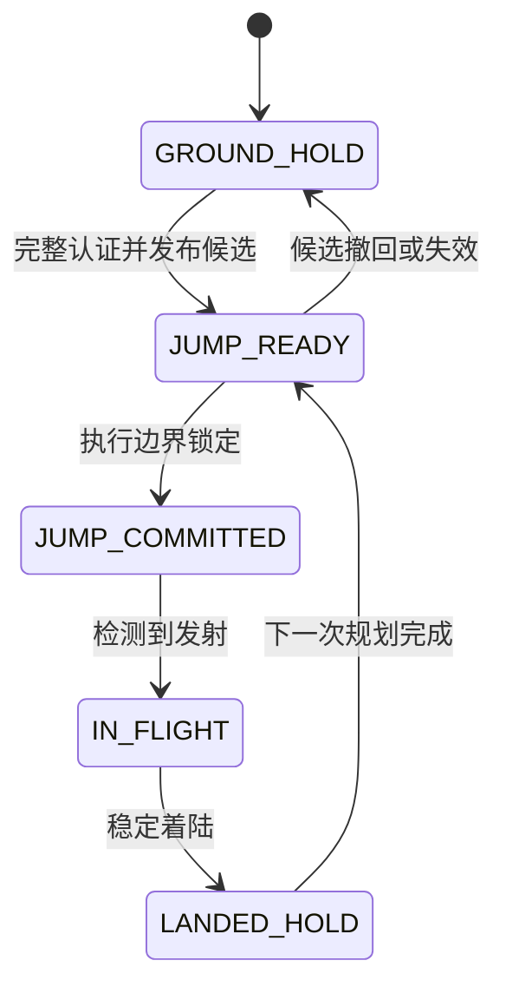

# 多平台路径规划 v3 设计规范

## 1. 文档状态

- 状态：逐项设计决策已确认，本文为 v3 冻结设计基线。
- 适用平台：可原地旋转且允许倒车的轮式平台、仅接收机体参考的足式平台、采用纯弹道质心平移的飞跃式平台。
- 核心实现：C++20；Python 仅用于离线标定、数据分析和可选模型训练。
- 实现隔离：采用 clean-room 路线，不读取、包装、移植或复制仓库内既有路径规划实现。
- 性能目标：在声明的固定基准配置上，单次路径规划 API 延迟 `P95 < 1 s`。
- 性能目标不是运行时截止时间。规划器不得因为墙钟时间到达 1 秒而中断、降级或改变结果。
- 本文是接口、安全语义、算法边界和验收规则的规范；引用文献只提供设计依据，不改变本文的规范性要求。

本文使用以下规范词：

- **必须**：实现和验收不可省略。
- **不得**：明确禁止。
- **应**：默认实现；偏离时必须给出书面理由和验证证据。
- **可选**：不影响基本安全合同的扩展能力。

---

## 2. 目标、优化准则与非目标

### 2.1 目标

一次调用应完成以下工作：

1. 对版本固定的地图、平台能力、当前状态和既有执行上下文进行一致性校验。
2. 在已知安全空间内解析任务目标；目标被未知区域隔开时，可退化为安全前沿目标。
3. 直接进入对应平台的状态空间搜索，不先生成一个要求所有平台共同跟随的二维全局路线。
4. 为轮式和足式平台生成可执行的几何路径及速度或时序参考。
5. 为飞跃式平台生成下一安全着陆范围、唯一飞跃边界条件和认证飞行管。
6. 输出原子化 `ReferenceBundle`，明确承诺前缀、预览、有效性和替换关系。
7. 当新解不可用时，保持既有安全承诺或输出静止保持；不得输出未经验证的参考。

### 2.2 优化准则

所有平台遵循同一优先级：

1. 首先满足硬安全、动力学可达性、地图已知性和接口一致性。
2. 在所有硬可行候选中，主目标是最小化预计执行时间。
3. 设最短预计时间为 \(T_{\min}\)。满足

   \[
   T \le T_{\min}+\Delta T_{\mathrm{eq}}
   \]

   的候选进入时间等价池。
4. 仅在时间等价池内，依次比较预计能耗、非致命风险和参考平滑性。

因此，能耗或平滑性不得换取超出 \(\Delta T_{\mathrm{eq}}\) 的额外执行时间，也不得覆盖硬安全判断。

### 2.3 非目标

本规划器不负责：

- 原始传感器融合、地图构建或地图更新。
- 轮式底层跟踪控制和执行器分配。
- 足式落足点、步态、接触序列、接触力或全身控制。
- 飞跃式平台的完整姿态轨迹或飞行中质心平移控制。
- 进程间执行器接线、默认策略替换、checkpoint 发布或 canary 启动。
- 把未知区域当作可通行区域进行执行级规划。
- 用学习模型修改硬安全边界或授予解析模型未证明的可行性。

---

## 3. 总体架构



### 3.1 共享层职责

共享层只承担：

- 输入合同和快照一致性校验。
- 地图与平台能力的安全投影。
- 目标、安全前沿和安全终止锚点解析。
- 统一的预计时间与次级代价语义。
- 可复用的有界 ARA* 搜索框架。
- 轮式与足式共用的二维凸走廊膨胀基础设施。
- 诊断、缓存、确定性排序和结果封装。

共享层可以生成二维避障代价到达估计，但它只能用作启发式或缓存，不能成为所有平台共同遵循的权威路线。

### 3.2 平台层职责

完成目标解析后立即按平台分支：

- 轮式：在含运动模式的 `SE(2)` 状态格点中搜索。
- 足式：在含高度可达区间的 `SE(2.5D)` 位姿格点中搜索。
- 飞跃式：在安全着陆域图中搜索，并对下一跳执行完整物理认证。

不得采用“先规划公共二维路线，再串行执行平台特定完整搜索”的双层权威规划结构。`route_skeleton` 由各平台搜索结果派生，只表达任务意图和诊断信息，不是执行参考。

---

## 4. 输入合同

### 4.1 `PlanningRequest`

```text
PlanningRequest
├── request_id
├── platform_type
├── state
│   ├── WheeledOrLeggedState
│   └── HopperState
├── goal_region
├── map_snapshot
├── platform_capability
├── planner_algorithm_config
├── optional_learned_cost_snapshot
├── previous_execution_context
└── request_metadata
```

一次调用开始后，以上对象必须保持不可变。规划器不得在调用过程中查询会变化的远程地图、能力配置或执行状态。

### 4.2 坐标、单位与时间

- 所有位置、速度、加速度和姿态必须标明同一个 `frame_id`。
- 单位统一为 SI：米、秒、弧度、牛顿及其导出单位。
- yaw 使用弧度；连续参考中的 yaw 必须解缠，避免在 \(\pm\pi\) 处跳变。
- 输入时间戳用于检查状态与地图是否陈旧、是否相互偏斜。
- `reference_time_origin` 是输出参考的相对时间原点。
- 请求中不设置运行时截止时间字段。
- 参考本身可以具有 `valid_from`、`valid_until` 和事件失效条件；这些是执行有效性，不是规划计算截止时间。

### 4.3 平台状态

轮式和足式平台使用：

```text
WheeledOrLeggedState
├── position_xyz
├── yaw
├── linear_velocity_xyz
├── yaw_rate
└── deterministic_error_bounds
    ├── position_bound
    ├── yaw_bound
    ├── linear_velocity_bound
    └── yaw_rate_bound
```

轮式和足式规划不要求四元数。roll、pitch 可作为诊断量输入，但不属于权威规划状态。

飞跃式平台使用：

```text
HopperState
├── position_xyz
├── orientation_body_to_frame
├── linear_velocity_xyz
├── angular_velocity_xyz
└── deterministic_error_bounds
    ├── position_bound
    ├── orientation_bound
    ├── linear_velocity_bound
    └── angular_velocity_bound
```

所有误差均表示确定性有界集合，不解释为概率分布或信念状态。

### 4.4 任务目标

`GoalRegion` 是确定性目标区域：

```text
GoalRegion
├── target_position_or_region
├── position_tolerance
├── optional_yaw_interval
├── mission_direction_hint
└── task_metadata
```

目标不是单一采样点的强制命中要求。对飞跃式平台，目标区域还要经过着陆足迹、状态误差和安全裕量侵蚀，才能形成可发布的安全着陆范围。

### 4.5 不可变地图快照

```text
MapSnapshot
├── snapshot_id
├── frame_id
├── source_timestamp
├── map_revision
├── bounds
├── resolution
├── layer_manifest
│   └── layer_name -> layer_version
└── immutable_data_handle
```

要求：

- 所有地图层必须来自同一个原子快照。
- `known/unknown`、高程、地形法向、粗糙度、障碍物和置信度层的版本必须可追踪。
- 快照生命周期必须覆盖整个调用。
- 缺层、跨版本拼接、坐标系不一致或句柄失效必须拒绝请求。
- 未知单元不得因插值、缓存缺失或学习预测而变为硬可行单元。

### 4.6 平台能力

```text
PlatformCapability
├── profile_id
├── profile_version
├── platform_type
├── collision_envelope
├── motion_model_id
├── hard_limits
├── certified_error_bounds
├── analytic_cost_model_id
└── platform_specific_parameters
```

解析能力基线必须完整且可独立运行。解码时必须把能力中的运动、解析代价和
飞跃重力引用，以及运动模型固定的误差模型、执行器/冲量模型和可选姿态收紧表，
解析为一次调用内不可变的 `ResolvedCapabilityBindings`；仅保存
`ContentRef` 而未解析模型内容不能进入平台规划。平台能力或任一嵌套绑定变化后，
所有依赖该能力的投影层、运动原语、启发式和验证缓存必须失效。

请求中的 `platform_capability` 是第 15.1 节 `SafetyCapabilityProfile` 的运行时不可变绑定，不是另一套独立安全配置。

### 4.7 既有执行上下文

```text
PreviousExecutionContext
├── active_bundle_ref
│   ├── id
│   ├── revision
│   └── content_hash
├── active_bundle_handle
├── committed_until_or_boundary
├── execution_cursor
├── controller_status
├── source_map_snapshot_ref
└── source_capability_ref
```

规划器必须验证：

- 活动引用仍存在且与平台匹配。
- 执行游标没有越过允许替换的边界。
- 已承诺部分与当前状态相容。
- 地图或能力变化没有触发显式失效条件。

### 4.8 可选学习代价快照

学习软代价只可通过请求开始前已经固定的不可变快照接入：

```text
LearnedCostSnapshot
├── snapshot_id
├── model_id
├── model_version
├── model_hash
├── input_schema_id
├── output_bounds
└── immutable_ready_handle
```

请求未携带该快照、句柄未就绪或校验失败时，本次调用从开始到结束只使用解析代价。在线规划不得等待模型加载，也不得根据模型推理完成的墙钟先后切换代价源。
本次调用若尝试学习快照，`call_diagnostics` 必须记录同一完整 ref；若发布的候选
实际使用有界学习软代价，`generation_evidence` 也必须记录该 ref。解析基线或
fallback 生成的 bundle 不得声称使用学习快照。

---

## 5. 统一输出合同

### 5.1 原子 `ReferenceBundle`

```text
ReferenceBundle
├── bundle_id
├── bundle_revision
├── bundle_hash
├── supersedes_bundle_id
├── source_request_id
├── source_map_snapshot_ref
│   ├── id
│   ├── revision
│   └── content_hash
├── source_safety_capability_ref
│   ├── id
│   ├── revision
│   └── content_hash
├── source_algorithm_config_ref
│   ├── id
│   ├── revision
│   └── content_hash
├── platform_reference
├── route_skeleton
│   ├── component_id
│   ├── component_hash
│   └── non_authoritative_content
├── committed_prefix
│   ├── component_id
│   ├── component_hash
│   └── inline_view
├── preview
│   ├── component_id
│   ├── component_hash
│   └── inline_view
├── validity
├── validation_summary
└── generation_evidence
```

`platform_reference` 是 `WheeledReference`、`LeggedBodyReference`、`HopperReference` 三者之一的类型安全变体，必须与请求的平台类型一致。

ID 规则：

- `bundle_id` 是唯一的原子激活、替换和回滚权威。
- 三个子组件各自具有可追踪 `component_id`，但不得单独激活。
- 相同 `component_id` 必须对应相同 `component_hash` 和相同规范化内容。
- 子组件必须随 bundle 内联传递，不允许二次远程获取。
- 不得混用不同 bundle 的子组件。
- 新 bundle 可以复用旧的已承诺子组件 ID，同时发布新的预览子组件。

`committed_prefix` 和 `preview` 必须是同一个 `platform_reference` 在承诺边界两侧的视图，不能是两个互相独立的权威路径副本。

bundle 只有通过带请求上下文的激活校验后才可交给仲裁器。该校验至少逐字段连接：

- `source_map_snapshot_ref == validity.required_map_snapshot_ref`，且飞跃 tube
  使用同一地图快照；
- `source_safety_capability_ref == validity.required_capability_ref`，并与请求的
  已解析能力完全一致；
- `source_algorithm_config_ref` 与本次请求的固定算法配置一致；
- 所有嵌套 `ContentRef` 都能由 registry 解析为声明类型，ID、revision 和 hash
  三元组完全匹配。

结构合法但 provenance 不一致的 bundle 不得激活。

### 5.2 有效性

```text
ReferenceValidity
├── valid_from
├── optional_valid_until
├── required_map_snapshot_ref
├── required_capability_ref
├── allowed_state_deviation
└── invalidation_conditions
```

典型失效条件包括：

- 地图修订改变已验证的碰撞或地形条件。
- 状态偏差超出认证误差包络。
- 平台能力版本改变。
- 执行游标已耗尽整个参考时域。
- 飞跃式平台已经锁定或发射，而请求仍试图替换当前一跳。

锁定或发射不是整个 Hopper bundle 的失效条件；它们只关闭替换资格，并要求通过
`CONTINUE_COMMITTED_JUMP` 继续同一不可变 bundle。只有地图/能力/状态安全条件
失效或参考时域真正耗尽，才进入 bundle 失效处理。

### 5.3 `route_skeleton`

`route_skeleton`：

- 由平台自身的离散搜索结果抽取。
- 只用于任务级可视化、诊断、未来重规划提示和进度估计。
- 不得直接传给控制器执行。
- 不得覆盖平台参考中的几何、时序、模式或飞跃边界。

### 5.4 轮式平台参考

轮式平台参考由有序的类型化分段组成：

```text
WheeledReference
├── reference_time_origin
├── segments[]
│   ├── DriveSegment
│   └── SpinSegment
└── safe_stop_anchor
```

`DriveSegment`：

```text
DriveSegment
├── segment_id
├── time_interval
├── direction = FORWARD | REVERSE
├── geometric_path P(s) = [x(s), y(s), z(s), yaw(s)]
├── time_scaling s(t), s ∈ [0, 1]
└── optional_derived_caches
    ├── signed_body_forward_speed
    └── yaw_rate
```

`SpinSegment`：

```text
SpinSegment
├── segment_id
├── time_interval
├── fixed_position_xyz
└── unwrapped_yaw(t)
```

数学真值是 `P(s)` 与 `s(t)`；显式速度和 yaw 角速度只能作为派生缓存，必须与数学真值一致。

约束：

- `s` 始终从 0 单调增加到 1，倒车不反转 `s`。
- 车体前向有符号速度：前进为正，倒车为负。
- 前进、倒车、自旋之间的切换点必须同时满足线速度和角速度为零。
- 同方向的连续行驶分段可在非零速度处连接。
- 原地旋转必须表示为 `SpinSegment`，不得伪装成零长度行驶段。

### 5.5 足式平台参考

```text
LeggedBodyReference
├── reference_point_id
├── reference_time_origin
├── geometric_path P(s) = [x(s), y(s), z(s), yaw(s)]
├── time_scaling s(t)
├── body_frame_velocity_envelope
├── terrain_normal_envelope
├── roll_pitch_diagnostic_envelope
└── safe_stop_anchor
```

`reference_point_id` 必须来自版本化平台能力，通常为 `base_link` 或固定名义机体中心。不得输出随腿部姿态变化的瞬时真实质心。若名称使用 `nominal_com`，它也必须明确定义为固定名义参考点。

本参考仅规定机体位置、yaw 和时序：

- yaw 可独立于路径切向变化。
- 允许侧向移动和原地转向。
- roll、pitch 不是权威参考，只能以允许包络或地形法向条件表达。
- 不包含足端位置、步态、接触时序或接触力。

足式输出必须带有：

```text
feasibility_scope = body_geometry_and_terrain_thresholds_only
footstep_feasibility_guaranteed = false
```

### 5.6 飞跃式平台参考

```text
HopperReference
├── GroundHoldAnchor
├── NextLandingRegion
├── JumpBoundary
├── PredictedLandingFootprint
├── CertifiedFlightTube
├── AttitudeBoundary
├── nominal_aim_point
└── future_route_preview
```

`NextLandingRegion`：

```text
NextLandingRegion
├── region_id
├── frame_id
├── convex_polygon_in_landing_plane
├── landing_plane
│   ├── origin
│   ├── normal
│   └── residual_bound
├── allowed_yaw_interval
├── terrain_certification
└── inward_safety_margin
```

`JumpBoundary`：

```text
JumpBoundary
├── boundary_id
├── lock_event
├── nominal_launch_position
├── nominal_launch_orientation
├── nominal_launch_velocity
├── nominal_launch_angular_velocity
├── allowed_launch_state_error_set
├── gravity_model_id
├── ballistic_time_origin = BALLISTIC_LAUNCH_EVENT
├── ballistic_flight_time
└── actuator_or_impulse_profile_id
```

`JumpBoundary` 中只有一组名义发射边界条件；`allowed_launch_state_error_set` 只定义该命令仍保持认证有效的执行容差，不提供第二个可选命令。
flight tube 和 landing window 的 offset 均相对检测到的
`BALLISTIC_LAUNCH_EVENT`，而不是规划响应时刻；tube 必须覆盖 `[0,T]`，landing
window 必须包含 `T`。

`PredictedLandingFootprint`：

```text
PredictedLandingFootprint
├── convex_center_landing_polygon
├── landing_time_window
├── landing_velocity_bounds
├── landing_yaw_interval
├── source_error_model_id
└── outer_approximation_margin
```

`CertifiedFlightTube` 由时间有序的保守三维凸截面或等价包围体组成，并记录碰撞认证使用的地图快照、机体旋转包络和误差模型。`AttitudeBoundary` 记录允许的起始姿态误差、起始角速度边界、目标姿态集合、着陆角速度边界以及着陆前稳定余量。

语义：

- `NextLandingRegion` 是单个确定性凸安全着陆范围，不是概率分布、信念状态或单个确定点。
- `GroundHoldAnchor` 是边界锁定前唯一 committed ground-hold 真值，包含认证
  静止状态、允许误差集合和地形证书；它不是第二个发射命令。
- `JumpBoundary` 是控制器唯一可执行的下一跳命令。
- `PredictedLandingFootprint` 是考虑全部声明误差后，实际机体中心落点的确定性最坏情况外包集合。
- 着陆时间窗与着陆线速度边界只在 `PredictedLandingFootprint` 中保存一份，
  `HopperReference` 顶层不得复制第二份。
- `nominal_aim_point` 只是解释性或内部求解参数，不是控制器可自由选择的目标。
- 控制器不得在 `NextLandingRegion` 内自行选择另一个点；改变目标必须重新规划并发布新 bundle。
- `future_route_preview` 只表达后续任务可行性，不授权第二跳。
- 在 `JUMP_READY` bundle 中，`committed_prefix` 只选择
  `GroundHoldAnchor`，`preview` 选择未锁定的唯一 `JumpBoundary`；锁定后通过既有
  execution context 继续同一 bundle，不把 preview 静默改写成 committed 内容。
- 请求的当前 Hopper 状态集合必须包含于 `GroundHoldAnchor` 的允许静止集合；
  anchor 与 `JumpBoundary` 的名义位置和姿态连续，速度跃迁及误差映射必须由同一
  已解析执行器/冲量 profile 认证，不能构造“A 点保持、B 点发射”的 bundle。
- `JumpBoundary.gravity_model_ref` 必须等于能力绑定的重力模型；
  `PredictedLandingFootprint.source_error_model_ref` 与
  `CertifiedFlightTube.error_model_ref` 必须等于本次调用固定的同一误差模型。

必须满足：

\[
\operatorname{PredictedLandingFootprint}
\oplus \operatorname{safe\_margin}
\subseteq \operatorname{NextLandingRegion}.
\]

并且圆周区间必须满足：

\[
\operatorname{footprint.landing\_yaw}
\subseteq
\operatorname{attitude.target.allowed\_yaw}
\subseteq
\operatorname{region.allowed\_yaw}.
\]

---

## 6. 共享层设计

### 6.1 输入与快照校验

校验顺序：

1. schema、枚举、数值有限性和单位。
2. `frame_id` 一致性。
3. 状态与地图时间偏斜。
4. 地图层原子一致性和句柄生命周期。
5. 平台类型、能力版本和运动模型一致性。
6. 既有 bundle、执行游标和承诺边界一致性。
7. 算法配置完整性和安全能力配置完整性。

安全能力字段缺失时不得使用宽松默认值。错误请求不进入搜索。

### 6.2 静态安全投影

从不可变地图和平台能力生成或读取以下版本化层：

- 已知区域掩码。
- 平台构型几何可行掩码。
- ESDF 或保守净空层。
- 坡度、粗糙度、台阶、沟隙和地形法向限制。
- 解析预计时间代价。
- 保守速度上限。
- 可选启发式代价到达缓存。

静态投影只说明构型在给定快照和能力下是否几何、地形可行。它不得把“能否从当前动态状态刹停”固化为单元属性。

### 6.3 安全终止锚点

轮式和足式平台采用安全停止锚点合同：

- 每个可激活的承诺前缀必须终止于一个解析认证的安全停止锚点。
- 锚点处目标线速度和 yaw 角速度均为零。
- 锚点地形和碰撞条件必须满足平台硬阈值。
- 不要求路径上的每一点都附带独立刹停可达证书。

飞跃式平台在空中没有停止锚点。只有整跳认证完成后才允许发布 `JUMP_READY`；发射后由飞跃承诺状态机管理。

紧急制动、姿态保命或碰撞后动作属于独立应急控制系统，不由正常路径规划器生成。

### 6.4 目标与安全前沿解析

解析规则：

1. 若目标区域与当前已知安全连通集相交，终端设为该安全交集。
2. 若目标区域位于已知硬障碍内，返回 `GOAL_INFEASIBLE`，不得改称安全前沿。
3. 若目标被未知区域隔开：
   - 提取已知安全与未知区域的边界单元。
   - 聚类成前沿候选。
   - 按平台碰撞包络、净空、终端尺寸和安全停止或着陆条件侵蚀与过滤。
   - 将全部合格候选作为平台搜索的多目标终端，不额外执行一遍完整公共全局搜索。
4. 任务排序估计为

   \[
   \hat T_{\mathrm{mission}}
   =
   T_{\mathrm{to\ frontier}}
   +
   h_T(\mathrm{frontier},\mathrm{final\ goal}).
   \]

   穿越未知区域的 \(h_T\) 只用于排序，不能授权执行。

输出：

```text
ResolvedTerminalSet
├── kind = GOAL | SAFE_FRONTIER | GOAL_INFEASIBLE | NO_KNOWN_SAFE_ROUTE
├── candidates[]
├── unresolved_tail
└── reason_code
```

`unresolved_tail` 只用于任务提示，不可执行。

### 6.5 可复用 ARA* 框架

共享搜索框架通过平台适配器工作：

```text
PlatformSearchAdapter
├── state_key(state)
├── expand(state)
├── hard_feasible(edge)
├── transition_time(edge)
├── admissible_time_heuristic(state, terminals)
├── secondary_costs(edge)
└── is_terminal(state)
```

主搜索键为：

\[
f_T(n)=g_T(n)+\epsilon h_T(n).
\]

要求：

- 硬约束先于代价计算过滤。
- ARA* 的次优界只针对离散图上的预计时间目标，不声称连续空间全局最优。
- 搜索在达到目标 \(\epsilon\)、有限图穷尽或命中配置的扩展数、候选数、内存等资源上限时终止。
- 资源上限与 1 秒性能指标相互独立。
- 若终止时存在已验证候选，则可发布候选，并在诊断中记录实际终止原因。
- 必须记录最终 \(\epsilon\)、主次代价、扩展数、重开数、候选数和终止原因。
- 固定输入、配置和线程策略下，候选排序必须确定。

得到离散候选后，先确定 \(T_{\min}\)，再建立时间等价池并进行次级代价比较。

### 6.6 轮式与足式安全走廊

轮式和足式采用 ESDF 引导的有界凸半平面膨胀：

1. 按平台碰撞外形和确定性误差膨胀障碍与未知区域。
2. 沿平台离散路径按弧长和几何变化采样。
3. 为每个种子段查找最近障碍边界。
4. 构造把种子与障碍分开的保守半平面。
5. 在固定最大迭代数和最大平面数内形成凸多边形。
6. 检查相邻走廊重叠；不满足时分裂、收缩或合并。
7. 对最终多边形在原始栅格和 ESDF 上重新验证。

平台收紧：

- 轮式：非圆形足迹、yaw 区间、曲率、倒车扫掠体和自旋扫掠体。
- 足式：高度区间、地形法向、坡度、粗糙度、机体速度包络和侧向净空。

若走廊构造、重叠或连续优化失败，必须回退到经过验证的离散运动原语，不得输出局部成功、局部未验证的混合路径。

飞跃式平台不复用二维走廊；它输出三维 `CertifiedFlightTube`。

### 6.7 解析代价与可选学习扩展

解析预计时间和硬可行性模型是强制基线。学习模型只可提供有界软代价修正，例如地形能耗或非致命滑移风险：

- 学习输出必须经过有限性、范围和版本检查。
- 修正值必须裁剪到配置包络。
- 学习模型不得修改碰撞、坡度、动力学或确定性误差硬边界。
- 请求开始前没有通过校验的 `LearnedCostSnapshot` 时，整次调用使用解析代价。
- 快照存在时，在线推理仍必须使用确定性的输入规模、批大小和操作上限；输出异常时，整次调用回退到解析代价。
- 回退不得改变硬可行集合。

---

## 7. 轮式平台层

### 7.1 运动边界

轮式平台具有：

- 原地旋转能力。
- 前进行驶能力。
- 倒车能力。
- 非完整约束行驶段与零位移自旋段。

本设计不假设 Ackermann 转向，也不把状态格点结果表述为 Ackermann 可行。

### 7.2 状态格点

离散状态：

\[
q=(i_x,i_y,i_\psi,m),
\]

其中：

```text
m ∈ {START, FWD, REV, SPIN_CW, SPIN_CCW}
```

速度不进入离散状态。停止、启动和方向切换时间由边代价及最终时序化处理。

离线或标定生成的运动原语包括：

- 前进直线和圆弧。
- 倒车直线和圆弧。
- 顺时针和逆时针原地旋转。
- 必要的停止、启动和模式切换边。

每个原语必须携带：

- 相对位姿变化。
- 几何扫掠样本或解析扫掠描述。
- 名义持续时间。
- 适用曲率、坡度、净空和速度限制。
- 次级能耗、风险与平滑性代价。

### 7.3 搜索

- 主边代价是标定的预计执行时间。
- 前进、倒车和自旋均进入同一个 ARA* 图。
- 前进与倒车之间的切换边包含减速至零、换向和重新加速的时间。
- 行驶与自旋之间的切换边包含线速度和角速度归零条件。
- 启发式必须是预计时间的下界，例如平移距离除以认证最大速度与最小旋转时间下界的组合。
- 能耗、滑移风险、换向次数和曲率变化只用于时间等价池内的排序。

### 7.4 连续几何路径

对每个 `DriveSegment`：

1. 在模式边界处分段。
2. 用夹持三次 B 样条拟合离散位姿。
3. 在凸走廊中执行固定最大迭代次数的顺序凸优化。
4. 约束信赖域、走廊、曲率、端点和已承诺控制点。
5. 前进段 yaw 由路径切向得到；倒车段 yaw 为切向加 \(\pi\)。
6. z 由局部地形拟合与车体固定偏置得到。
7. 已承诺分段不得被平滑器修改。

平滑后的预计时间不得超过离散基线加 \(\Delta T_{\mathrm{eq}}\)。若连续优化、验证或时间条件失败，整个分段回退为已验证离散原语，不得只保留未经整体认证的局部样条。

### 7.5 速度与时序

行驶段采用 TOPP-RA 风格的前向/后向可达传播：

1. 对 \(s\in[0,1]\) 自适应离散。
2. 计算每个采样点的局部上限：
   - 车体前向速度。
   - yaw 角速度。
   - 曲率与横向加速度。
   - 牵引或制动能力。
   - 坡度、粗糙度和净空。
   - 终端停止条件。
3. 前向传播可达速度上界。
4. 后向传播制动可达上界。
5. 生成分段常加速度、单调的 \(s(t)\)。
6. 可选执行不突破上界的 jerk 平滑。

自旋段使用梯形或受限 S 曲线 yaw 时序，起止 yaw 角速度必须为零。

### 7.6 连续验证

验证至少包括：

- 直线和圆弧原语的解析或保守扫掠验证。
- B 样条凸包或自适应细分碰撞验证。
- 非圆形车体在完整 yaw 变化下的占据验证。
- 倒车和自旋扫掠体。
- 地形坡度、粗糙度、台阶和净空。
- 曲率、速度、角速度、加速度、制动和模式切换边界。
- 承诺末端安全停止锚点。

### 7.7 轮式降级顺序

1. 经过连续验证的平滑路径与时序。
2. 经过验证的离散原语与保守时序。
3. 继续当前 bundle 的承诺前缀直至安全停止锚点。
4. 若已经静止且当前位置安全，发布静止保持。
5. 否则返回无安全规划参考。

降级由可行性和算法终止结果触发，不由墙钟到达 1 秒触发。

---

## 8. 足式平台层

### 8.1 能力边界与保证范围

足式规划器仅生成机体参考。它采用简单解析地形阈值，不搜索落足点或支撑模板，并直接作为权威机体参考发布。

因此必须明确：

```text
feasibility_scope = body_geometry_and_terrain_thresholds_only
footstep_feasibility_guaranteed = false
```

规划器可以保证机体几何、已知地形阈值、速度包络和碰撞条件得到验证，但不得声称存在一组实际可执行的落足序列。

### 8.2 状态与高度可达区间

离散状态：

\[
q=(i_x,i_y,i_\psi).
\]

每个状态携带连续高度可达区间：

\[
I_z(q)=[z_{\min}(q),z_{\max}(q)].
\]

参考高度为：

\[
z_{\mathrm{ref}}
=
\operatorname{clamp}
\left(z_{\mathrm{preferred}},I_z(q)\right).
\]

边扩展时必须传播高度区间可达性，而不是只检查单个离散 z 值。若相邻状态的可达高度区间在运动原语限制下没有连续连接，则该边不可行。

### 8.3 解析地形可通行性

硬阈值包括：

- 地图已知性和最小置信度。
- 坡度。
- 粗糙度和平面拟合残差。
- 可跨越台阶高度。
- 可跨越沟隙宽度。
- 机体高度范围。
- 机体碰撞与侧向、顶部净空。
- 地形法向变化。
- 平台能力中声明的局部速度限制。

这些阈值来自 `SafetyCapabilityProfile`。不得用学习模型或软代价放宽。

### 8.4 机体运动原语与搜索

能力配置中的机体运动原语可包括：

- 车体前向和后向平移。
- 左右侧向平移。
- 对角平移。
- 原地转向。
- 可选平移与 yaw 耦合原语。

每个原语描述车体参考点的相对运动、名义持续时间、采样点和允许地形条件，不描述腿部动作。

搜索规则：

- 主边代价是经过地形缩放和标定的预计执行时间。
- yaw 不与路径切向绑定。
- 侧移和转身均直接进入状态格点。
- 高度区间、碰撞和地形硬阈值在扩展时过滤。
- 能耗、姿态变化、侧移偏好和粗糙度风险只在时间等价池中比较。

### 8.5 足式安全走廊

足式走廊可表示为：

\[
\mathcal C_i
=
\mathcal P_{xy,i}
\times I_{z,i}
\times I_{\psi,i}.
\]

只有当整个笛卡尔积都通过碰撞、地形和机体包络检查时，才能使用该表达。若某些 xy、z、yaw 组合不可行，必须分裂或收缩走廊，不能仅验证中心线后默认整个积空间安全。

### 8.6 机体执行参考

1. 对 x、y、z 和解缠 yaw 分别使用夹持三次 B 样条。
2. 在固定最大迭代次数的顺序凸优化中满足走廊、端点、平滑性和已承诺控制点约束。
3. yaw 独立优化，不施加 yaw 等于切向或等效曲率约束。
4. 平滑后预计时间不得超过离散基线加 \(\Delta T_{\mathrm{eq}}\)。
5. 沿路径转换到机体系，计算前后、左右、竖直速度及 yaw 角速度上限。
6. 用前向/后向可达传播生成 \(s(t)\)。
7. 安全停止锚点处平移速度和 yaw 角速度为零。

若走廊、优化或验证失败，整个相关分段回退为验证过的机体运动原语和保守时序。

### 8.7 下游合同

下游运动控制器负责：

- 根据机体参考生成足端、步态和接触力。
- 跟踪 `reference_point_id` 定义的固定机体点。
- 监测落足或接触可行性。
- 无法实现参考时请求重新规划或进入自身安全模式。

本设计不设置下游“预接受后才使 bundle 生效”的额外门控。bundle 激活后，足式机体参考直接权威生效；这也是必须保留 `footstep_feasibility_guaranteed = false` 声明的原因。

### 8.8 足式降级顺序

1. 经过连续验证的平滑机体路径与时序。
2. 经过验证的离散机体原语与保守时序。
3. 继续当前 bundle 的承诺前缀直至安全停止锚点。
4. 若已静止且当前机体位姿安全，发布静止保持。
5. 否则返回无安全规划参考。

---

## 9. 飞跃式平台层

### 9.1 物理边界

飞跃式平台采用纯弹道质心平移：

\[
p(t)=p_0+v_0t+\frac12gt^2,
\qquad
v(t)=v_0+gt.
\]

约束：

- 发射后没有质心平移控制。
- 空中姿态控制不得被建模为改变质心弹道。
- 局部重力在一次规划中为常量，但必须携带模型 ID、坐标系、空间和时间有效范围及确定性误差界。
- 若重力模型超出有效范围，候选不可认证。
- 规划器只发布下一跳；着陆稳定后重新规划。

### 9.2 安全着陆范围生成

着陆范围生成流程：

1. 按候选 yaw 区间建立姿态相关的安全位姿掩码。
2. 用非圆形着陆足迹、状态误差和安全裕量侵蚀地图。
3. 排除未知、障碍、坡度超限、粗糙度超限和净空不足单元。
4. 用距离变换选择具有较大内切余量的种子。
5. 采用有界凸膨胀形成候选区域。
6. 在原始栅格上精确复核，不得直接对含洞或凹形安全掩码取凸包。
7. 顶点简化必须向内保守，不得扩张到未验证区域。
8. 对完整 yaw 区间验证着陆扫掠足迹。
9. 整个区域必须能由单个地面平面、法向和残差上界描述；否则收缩或分裂。

此阶段得到 `TerrainCertifiedLandingRegion`。它只有在弹道、姿态、落点范围和发射边界全部认证后，才能作为 `NextLandingRegion` 发布。

### 9.3 有向惰性着陆域图

图节点是安全着陆域，边状态为：

```text
CHEAP_POSSIBLE
CERTIFIED_NEXT_HOP
REJECTED
```

流程：

1. 用距离、正飞行时间、速度和粗略弹道时间下界进行便宜筛选；能量估计只作为
   硬可行候选的有界次级排序量，不得用于拒绝边。
2. 在有向着陆域图上运行 ARA*，主代价仍为预计执行时间。
3. 对候选任务路线的第一条边执行完整物理认证。
4. 认证失败时把该边标记为 `REJECTED`，继续图搜索。
5. 维护完整认证 incumbent；继续认证所有仍满足
   `first_edge_time_lower_bound <= incumbent_time + ΔT_eq` 的竞争第一边。
6. 所有竞争第一边已排除后，按真实预计执行时间选择；若完整认证尝试上限先触发，
   只能发布完整认证 incumbent，并显式标记“竞争边未排尽”的资源受限诊断，
   不得声称时间最优或 ARA* 次优界。

节点数、出度、候选瞄准点数、完整认证尝试数和区间细分深度必须有配置上限。

后续节点只形成 `future_route_preview`。后续可达性是任务层元数据，不是当前一跳的物理安全证书。若当前区域安全但没有后续已知安全跳，使用 `reason_code = SAFE_DEAD_END`；它不是新的 `planning_outcome`。

### 9.4 名义瞄准点与飞行时间

每个凸着陆域只选取有限个确定性名义瞄准点，例如：

- Chebyshev 中心或最大净空点。
- 目标区域在安全域内的投影点。
- 沿任务方向的内部点。
- 少量固定规则生成的高余量点。

对固定瞄准点 \(p_a\)，唯一连续变量为飞行时间 \(T\)：

\[
v_0(T)
=
\frac{p_a-p_0}{T}
-
\frac12gT,
\]

\[
v_f(T)
=
\frac{p_a-p_0}{T}
+
\frac12gT.
\]

求解方法：

1. 由严格正飞行时间、能力的最小/最大飞行时间、起跳速度、可解析执行器冲量、
   着陆速度、向下横截性和姿态时间条件求解析可行时间区间。
2. 在约束表达式的解析断点处分段。
3. 采用固定最大深度的区间细分排除不可行区间。
4. 对剩余一维根或极值使用有界二分或 Brent 法。
5. 对有限候选执行完整验证。

候选选择遵循：硬可行、最短预计时间、时间等价池内最低能耗，再比较着陆余量和飞行净空。
能量是由固定解析代价模型给出的有界估计，不是 `HopperLaunchLimits` 的硬约束；
最高点只用于重力有效域和连续碰撞区间切分，不形成未声明的高度上限。

飞跃边的预计执行时间至少包括发射准备时间、弹道飞行时间 \(T\) 和着陆稳定时间。姿态重定向若与弹道飞行并行，不得重复计时，但必须满足着陆前稳定约束。

### 9.5 连续弹道碰撞认证

为每个候选弹道：

1. 在发射、最高点、地形边界变化和着陆附近建立时间区间。
2. 用机体外形、任意姿态旋转包络和全部确定性误差构造保守扫掠体。
3. 枚举每个时间区间水平投影覆盖的全部地图单元：
   - 重力与栅格竖直轴一致时，可使用 supercover DDA。
   - 一般情况使用二次投影的自适应保守细分。
4. 对每个重叠单元解析求时间区间内的最小竖直净空。
5. 未知、相交或数值无法判定均拒绝候选。
6. 在固定最大细分深度内完成认证。

认证结果输出为按时间有序的 `CertifiedFlightTube`。该对象是经验证的三维保守扫掠管，不是二维走廊的简单外推。

### 9.6 姿态可达性认证

采用“认证的保守任意轴能力包络 + 可选收紧查表”：

- 基础能力给出任意旋转轴下保守角速度与角加速度上限。
- 可选离线查表只能收紧基础包络，不能放宽。
- 发射时角速度必须位于近零容差内。
- 目标姿态候选由着陆面法向和允许 yaw 区间生成。
- 起始与目标姿态的最短四元数夹角为

  \[
  \theta
  =
  2\arccos\left(\left|\langle q_0,q_f\rangle\right|\right).
  \]

- 用保守 bang-bang 旋转时间下界、姿态稳定时间和安全余量验证能否在着陆前完成。
- `AttitudeBoundary` 只给出起始状态、目标姿态集合、角速度边界和要求的着陆前稳定余量，不输出完整姿态轨迹。
- 飞行碰撞认证始终使用任意姿态旋转包络，不能假设姿态严格跟随某条未输出轨迹。

### 9.7 确定性落点范围

将以下量表示为确定性集合：

- 初始位置误差。
- 初始速度误差。
- 重力模型误差。
- 着陆平面参数误差。
- 发射边界执行误差。

处理流程：

1. 对所有误差集合求着陆平面相交时间区间 \([T^-,T^+]\)。
2. 使用有界区间求根或二分。
3. 要求着陆相交具有向下横截性；若可能切触或多解，拒绝候选。
4. 在完整时间与误差集合上传播位置集合。
5. 用固定最大顶点数的凸多边形保守外包水平落点。
6. 输出着陆时间窗、着陆速度边界、误差模型 ID 和认证余量。

最终必须验证：

\[
\operatorname{PredictedLandingFootprint}
\oplus \operatorname{safe\_margin}
\subseteq \operatorname{NextLandingRegion}.
\]

### 9.8 最终物理认证

一条下一跳必须同时通过：

- 着陆地形和完整 yaw 区间认证。
- 正飞行时间、发射速度、执行器/冲量和执行边界认证。
- 连续弹道 `CertifiedFlightTube` 碰撞认证。
- 姿态可达与着陆前稳定认证。
- 着陆时间窗和速度边界认证。
- 确定性落点范围包含关系。
- 着陆后静止保持条件。

任一项失败都不得发布新的 `JumpBoundary`。飞跃启动后不得通过重新规划改变当前质心弹道。

---

## 10. 承诺、激活与降级

### 10.1 bundle 原子激活

- 控制器只按 `bundle_id` 原子激活完整 bundle。
- `supersedes_bundle_id` 明确替换链。
- 激活前必须完成对应平台的全部规定验证。
- 子组件 ID 只用于追踪和复用，不提供独立激活权限。

### 10.2 轮式与足式承诺

- `committed_prefix` 终止于安全停止锚点。
- 重新规划不得修改执行游标之前或已承诺的控制点。
- 新预览不可用时，执行器继续当前承诺前缀至锚点。
- `HOLD_STATIONARY` 只允许在平台已经静止且当前位置解析安全时返回；该指令不创建或激活新 bundle。
- 移动中的减速过程必须是承诺前缀的一部分，不能用静止保持替代。

### 10.3 飞跃式承诺状态机



规则：

- `JUMP_READY` 之前可替换候选。
- 在 `JUMP_READY` 中，地面静止保持属于 `committed_prefix`，待执行的 `JumpBoundary` 属于 `preview`。
- `JUMP_COMMITTED` 后不得改变当前 `JumpBoundary`。
- 进入 `JUMP_COMMITTED` 后只更新 `PreviousExecutionContext` 的锁定边界和执行游标；
  已激活 bundle 保持不可变，继续执行其中原有的唯一 `JumpBoundary`。
- `IN_FLIGHT` 阶段只可更新状态估计、着陆预测和应急建议，不能发布重定向弹道。
- 稳定进入 `LANDED_HOLD` 后才允许激活下一跳。
- 地图突变若使已承诺动作失效，进入独立应急状态，而不是把应急动作伪装成正常重规划结果。

### 10.4 平台通用降级原则

当新参考不可用时，按以下原则处理：

1. 若活动 bundle 的承诺仍有效，继续活动承诺。
2. 若平台已安全静止，保持静止。
3. 若没有安全规划参考，明确返回 `NO_SAFE_PLANNER_REFERENCE`。

不得为了“总是返回一条新路径”而降低硬安全条件。

---

## 11. C++ 核心实现

### 11.1 模块边界

建议模块：

```text
planner_core/
├── contracts/
│   ├── planning_request.hpp
│   ├── reference_bundle.hpp
│   └── status.hpp
├── map/
│   ├── immutable_snapshot.hpp
│   ├── safe_projection.hpp
│   └── esdf_corridor.hpp
├── search/
│   ├── ara_star.hpp
│   └── platform_adapter.hpp
├── wheel/
│   ├── wheel_lattice.hpp
│   ├── wheel_geometry.hpp
│   └── wheel_timing.hpp
├── leg/
│   ├── leg_lattice.hpp
│   ├── height_interval.hpp
│   └── body_reference.hpp
├── hopper/
│   ├── landing_region.hpp
│   ├── landing_graph.hpp
│   ├── ballistic_solver.hpp
│   ├── flight_tube.hpp
│   └── landing_set.hpp
├── validation/
│   ├── contract_validator.hpp
│   ├── continuous_validator.hpp
│   └── bundle_validator.hpp
└── diagnostics/
    ├── trace.hpp
    └── benchmark_metrics.hpp
```

### 11.2 热路径约束

- 热路径全部使用 C++20。
- 地图以只读连续内存、分块只读视图或等价不可变句柄访问。
- 预分配节点池、候选池、走廊缓冲区和区间计算缓冲区。
- 使用持久工作线程，避免每次调用创建线程。
- 调用过程中不得执行阻塞式远程 RPC、磁盘读取或模型加载。
- 外部数值求解器必须有确定的迭代、变量和内存上限。
- 学习模型若启用，应在请求前加载，并通过有界本地接口调用。
- 所有资源上限来自 `PlannerAlgorithmConfig`，不从墙钟 1 秒指标派生。

### 11.3 确定性

固定输入、配置和线程策略时：

- 状态键、哈希和浮点量化规则固定。
- 开放表并列项使用稳定次序。
- 候选并行验证结果按候选稳定 ID 仲裁。
- 随机化算法必须使用显式种子并记录。
- 不允许以“谁先完成”决定候选优先级。
- 不允许以墙钟剩余时间决定是否进入某个算法分支。

### 11.4 缓存

缓存键至少包含：

- 地图快照或相关层版本。
- 平台能力版本。
- 算法配置版本。
- 坐标系与分辨率。
- 影响结果的误差模型版本。

缓存内容必须只读发布，并在任一相关版本变化时失效。缓存命中不得绕过当前请求的输入和最终连续验证。

---

## 12. 性能测试与实验指标

### 12.1 指标定义

在每个平台声明的固定 `BenchmarkProfile` 上：

\[
\operatorname{P95}(\text{single-call API latency}) < 1\,\mathrm{s}.
\]

该条件是实验验收指标，不是单次请求的运行时截止条件：

- 规划器不会在任何预设墙钟里程碑停止新计算或强制返回。
- 超过 1 秒只影响性能统计与 `p95_latency_target_met` 诊断。
- 规划状态、候选选择和安全降级不得仅因墙钟时间越过 1 秒而改变。

### 12.2 计时边界

主指标从进程内 API 接收完整不可变请求开始，到完成以下内容并生成可返回响应为止：

- 输入和版本校验。
- 请求相关的安全投影查询或增量计算。
- 目标或前沿解析。
- 平台搜索。
- 走廊、连续路径与时序生成，或飞跃物理认证。
- 最终验证。
- bundle 封装和响应序列化。

不计入主指标：

- 原始传感器处理和建图。
- 进程启动。
- 地图或模型的离线加载。
- 跨网络传输。

冷启动必须单独报告，不能混入或替代主指标。

### 12.3 报告内容

每个平台至少报告：

- 样本数量。
- 平均值、中位数、P95、P99 和最大值。
- 冷启动与稳态结果。
- 硬件、操作系统、编译器、优化级别和线程数。
- 地图尺寸、分辨率、已知率、障碍密度和地形复杂度。
- 起终点距离、搜索扩展数、候选数和最终终止原因。
- 各模块耗时分解。
- `p95_latency_target_met`。

### 12.4 有限终止与性能优化

算法有限终止由以下机制保证：

- 有限离散图和 ARA* 目标 \(\epsilon\)。
- 搜索扩展数、开放表、内存和候选数上限。
- 走廊平面数和迭代数上限。
- SCP/QP 迭代数上限。
- 飞跃图节点、出度、瞄准点和认证尝试上限。
- 区间求根和碰撞细分深度上限。

这些上限用于确定性资源治理。它们可以通过基准实验调优，但不得在运行时根据距 1 秒还有多少墙钟时间动态改变。

---

## 13. 返回状态与不变量

### 13.1 正交状态字段

```text
PlanningResponse
├── planning_outcome
├── execution_directive
├── reason_code
├── optional new_reference_bundle
├── optional active_bundle_ref
└── call_diagnostics
```

`planning_outcome`：

```text
NEW_REFERENCE_READY
SAFE_FRONTIER_REFERENCE_READY
NO_KNOWN_SAFE_ROUTE
GOAL_INFEASIBLE
INVALID_REQUEST
STALE_INPUT
NUMERICAL_FAILURE
RESOURCE_LIMIT
ACTIVE_REFERENCE_INVALIDATED
```

`execution_directive`：

```text
ACTIVATE_NEW_BUNDLE
CONTINUE_ACTIVE_BUNDLE
HOLD_STATIONARY
CONTINUE_COMMITTED_JUMP
NO_SAFE_PLANNER_REFERENCE
```

### 13.2 状态不变量

- `ACTIVATE_NEW_BUNDLE` 必须携带经过完整验证的 bundle。
- `NEW_REFERENCE_READY` 或 `SAFE_FRONTIER_REFERENCE_READY` 才能与 `ACTIVATE_NEW_BUNDLE` 组合。
- `CONTINUE_ACTIVE_BUNDLE` 必须验证活动承诺仍有效；`ACTIVE_REFERENCE_INVALIDATED` 不得与该指令组合。
- `CONTINUE_ACTIVE_BUNDLE` 与 `CONTINUE_COMMITTED_JUMP` 必须携带匹配的 `active_bundle_ref`；其他指令不得携带该字段。
- `HOLD_STATIONARY` 只能在当前状态已静止且位置安全时使用，并且不得携带待激活的新 bundle。
- `CONTINUE_COMMITTED_JUMP` 只适用于 `JUMP_COMMITTED` 或 `IN_FLIGHT`。
- `GOAL_INFEASIBLE` 只表示目标位于已知硬不可行区域。
- `NO_KNOWN_SAFE_ROUTE` 表示当前已知安全空间中没有可发布路线。
- `RESOURCE_LIMIT` 只在资源上限终止且没有可激活的已验证候选时使用。
- 若命中资源上限但已有完整验证候选，应返回相应的 READY 结果，并在诊断中记录终止原因。
- API 延迟是否超过 1 秒不得作为 `planning_outcome` 或 `execution_directive` 的决定因素。

---

## 14. 验证与验收

### 14.1 合同和状态机验证

必须覆盖：

- schema、单位、坐标系、时间戳和数值有限性。
- 地图层原子一致性。
- 平台能力、算法配置和缓存版本。
- `bundle_id` 原子激活和子组件禁止混用。
- 承诺边界、执行游标和 bundle 替换链。
- 轮式、足式安全停止锚点。
- 飞跃式完整状态机和发射后不可重定向。
- 每个返回状态组合的不变量。

### 14.2 通用算法与安全属性

属性测试至少验证：

- 未知区域永远不成为硬可行执行区域。
- 硬约束过滤不受软代价或学习模型影响。
- ARA* 启发式满足声明的时间下界条件。
- 时间等价池只包含 \(T\le T_{\min}+\Delta T_{\mathrm{eq}}\) 的候选。
- 走廊和连续路径完全位于验证安全集内。
- 资源上限触发时不输出半验证参考。
- 固定输入、配置和线程策略产生确定结果。
- 学习模型不可用或异常时与解析基线具有相同硬可行集合。

### 14.3 轮式场景

至少包括：

- 前进、倒车和前后方向切换。
- 狭窄区域原地旋转。
- 非圆形足迹自旋扫掠。
- 曲率受限行驶。
- 坡地、台阶边界和低净空。
- 走廊构造失败后完整回退到离散原语。
- 平滑失败、时序失败和连续验证失败。
- 活动承诺继续至安全停止锚点。

### 14.4 足式场景

至少包括：

- 前后、侧向、对角和平地原地转向。
- 高度区间收缩、断开和连续传播。
- 坡度、粗糙度、台阶、沟隙和低顶净空。
- yaw 与路径切向独立。
- 走廊笛卡尔积中存在局部不可行组合。
- 平滑和时序失败后的离散机体原语回退。
- 输出始终携带机体/地形有限保证和无落足保证声明。

验收不得把“下游偶然找到落足序列”当作本规划器的硬保证证据。

### 14.5 飞跃式场景

至少包括：

- 凹形、含洞和窄颈安全掩码。
- 非圆形着陆足迹和完整 yaw 区间侵蚀。
- 多地面平面导致区域收缩或分裂。
- 弹道穿越障碍、未知单元和低净空地形。
- 最高点附近和地形边界附近的连续碰撞。
- 任意轴姿态能力包络和收紧查表。
- 落点误差集合、着陆时间区间和向下横截性。
- 落点外包集合不满足包含关系时拒绝。
- 零飞行时间、超出能力飞行时间区间或 capability/reference provenance 不一致时拒绝。
- 请求状态、ground-hold anchor 和 launch boundary 不连续时拒绝。
- 第一条下界较优但完整认证后真实时间较差时，仍选择真实时间更短的竞争边；
  尝试上限触发时只报告完整认证 incumbent，不伪造最优界。
- 有安全当前落区但无后续跳时返回 `reason_code = SAFE_DEAD_END`。
- 发射锁定后拒绝替换，稳定着陆后才规划下一跳。

### 14.6 故障注入

必须注入：

- 地图快照过期或图层版本不一致。
- 能力版本变化。
- 缓存版本错误。
- 学习模型不可用、非有限输出或越界输出。
- 数值求解不收敛。
- 内存、扩展数、候选数或迭代数达到配置上限。
- 活动引用丢失或执行游标非法。

故障结果必须符合返回状态不变量，且不得产生未验证 bundle。

### 14.7 性能验收

- 按每个平台固定 `BenchmarkProfile` 独立运行。
- 主验收为稳态单次 API 延迟 P95 小于 1 秒。
- 同时报告 P99、最大值和冷启动。
- 运行不设置 1 秒截止或基于剩余墙钟时间的分支。
- 若 P95 未达标，结论是性能指标失败；不得通过提前返回低质量结果伪造达标。

---

## 15. 配置治理

### 15.1 `SafetyCapabilityProfile`

包含所有硬安全和物理边界：

- 碰撞外形和参考点。
- 坡度、粗糙度、台阶、沟隙、净空。
- 速度、角速度、加速度、制动，以及飞跃执行器/冲量边界。
- 轮式运动模型与原语认证边界。
- 足式机体原语与高度区间边界。
- 飞跃重力、起跳、姿态、着陆和确定性误差模型；着陆地形硬阈值必须显式包含
  坡度、粗糙度、单平面残差、顶/侧净空和最小非退化着陆域面积。

该配置必须完整、版本化、可哈希。缺失字段不得用宽松默认值补齐。

### 15.2 `PlannerAlgorithmConfig`

包含：

- 状态分辨率与 yaw 离散。
- 运动原语集 ID。
- ARA* 初始、递减和目标 \(\epsilon\)。
- 搜索、内存、候选和迭代资源上限。
- \(\Delta T_{\mathrm{eq}}\)。
- 走廊、SCP/QP 和时序化参数。
- 飞跃图规模、瞄准点、求根和细分上限。
- 可选学习软代价模型 ID 及裁剪范围。

该配置不得包含用于中断规划的 1 秒运行时截止设置。

### 15.3 `BenchmarkProfile`

只用于性能实验：

- 硬件、操作系统、编译器和线程数。
- 地图集合、场景分布和平台能力版本。
- 三个平台共享的算法配置 ID、修订和哈希。
- 预热次数、样本数和冷启动规则。
- API 计时边界。
- P95 小于 1 秒的验收阈值。

运行时规划器不得读取 `BenchmarkProfile` 来截断搜索或改变结果。

### 15.4 追踪与缓存失效

运行时 `ReferenceBundle` 必须记录 `SafetyCapabilityProfile` 与 `PlannerAlgorithmConfig` 的 ID、修订和哈希。固定三平台基准中，每个平台 suite/result 分别记录其 `SafetyCapabilityProfile` 的 ID、修订和哈希；报告顶层记录三平台共享的 `PlannerAlgorithmConfig` 与 `BenchmarkProfile` 的 ID、修订和哈希。任何影响安全、搜索图、代价、误差传播或验证结果的字段变化，都必须使相关缓存失效。

---

## 16. 设计依据

以下资料只解释算法选择，不是规范的一部分：

- [Efficient Constrained Path Planning via Search in State Lattices](https://www.cs.cmu.edu/~alonzo/pubs/papers/isairas05Planning.pdf)：轮式状态格点和运动原语。
- [ARA*: Anytime A* with Provable Bounds on Sub-Optimality](https://proceedings.neurips.cc/paper/2003/file/ee8fe9093fbbb687bef15a38facc44d2-Paper.pdf)：可改进的有界次优图搜索。
- [A New Approach to Time-Optimal Path Parameterization Based on Reachability Analysis](https://arxiv.org/abs/1707.07239)：基于路径的速度可达传播。
- [ArtPlanner: Robust Legged Robot Navigation in the Field](https://arxiv.org/abs/2303.01420)：足式机体级路线规划和地形可通行性。
- [Planning and Execution of Dynamic Whole-Body Locomotion for a Hydraulic Quadruped on Challenging Terrain](https://arxiv.org/abs/1904.03695)：机体路径与下游全身运动生成的分层。
- [Humanoid Path Planning over Rough Terrain using Traversability Assessment](https://arxiv.org/abs/2203.00602)：基于 2.5D 地形评估的足式位姿规划。
- [Motion Planning on an Asteroid Surface with Irregular Gravity Fields](https://arxiv.org/abs/1902.02065)：低重力表面弹道运动规划。
- [Hopping Trajectory Planning for Asteroid Surface Exploration Accounting for Terrain Roughness](https://www.jstage.jst.go.jp/article/tjsass/64/4/64_T-20-54/_pdf)：考虑地形粗糙度的飞跃轨迹规划。
- [Lidar-Based Hazard Avoidance for Safe Landing on Mars](https://www-robotics.jpl.nasa.gov/media/documents/aejJGCD2002.pdf)：安全着陆区和危险规避。
- [SpaceHopper: A Small-Scale Legged Robot for Exploring Low-Gravity Celestial Bodies](https://arxiv.org/abs/2403.02831)：低重力飞跃平台及其运动边界。

最终实现的能力声明不得超过原论文、平台标定结果及本文实际验证范围。

---

## 17. 已冻结的核心决策

- 共享层提供安全投影、目标解析、统一代价和 ARA* 基础设施；平台层直接在自身状态空间搜索。
- 轮式和足式不使用四元数作为规划状态；飞跃式使用四元数和三维角速度。
- 轮式允许原地旋转和倒车，输出类型化 `DriveSegment` 与 `SpinSegment`。
- 足式只输出固定机体参考点的 x、y、z、yaw 和时序，不输出落足、步态或接触力。
- 足式采用解析地形阈值、直接权威激活，并明确不保证足步可行。
- 飞跃式质心采用纯弹道平移。
- 飞跃式输出确定性下一着陆范围、唯一飞跃边界、确定性落点外包和认证飞行管。
- 飞跃姿态使用认证的保守任意轴能力包络，可选查表只能收紧。
- 轮式和足式承诺前缀终止于安全停止锚点；不要求路径每一点附带独立刹停证书。
- bundle 使用一个原子权威 ID 和三个可追踪子组件 ID。
- 主优化目标是预计执行时间；能耗、风险和平滑性只在时间等价池内比较。
- 学习模型只可修正有界软代价，解析模型始终足以独立运行。
- 所有在线热路径采用 C++20。
- 单次 API 延迟 `P95 < 1 s` 是固定基准上的实验指标，不是运行时截止时间。

本文确认后，下一步应编写实现计划、接口 schema、平台能力 profile schema 和分层测试计划。
