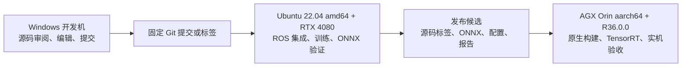

# Lunar Navigation 新项目 ROS 2 与 Jetson 架构重编排设计

## 1. 文档状态

- 状态：总体架构、外部接口边界、异常降级、测试矩阵、迁移路线和 Codex 时间估算均已逐项确认。
- 当前文档位置：旧项目保存迁移设计基线；新项目建立后，本文应作为首批架构文档迁入。
- 目标项目：新建单一 Git 仓库，不延续父仓库、gitlink 子仓库和跨仓库隐式导入结构。
- 目标运行系统：Ubuntu 22.04 LTS、ROS 2 Humble。
- 训练与集成主机：amd64、RTX 4080。
- 最终部署设备：Jetson AGX Orin 64GB、aarch64、当前 L4T R36.0.0；允许未来升级，但 R36.0.0 在新版本完成验收前始终是最低兼容基线。
- 默认路径规划器：C++ v3。旧 Python A* 只在迁移期作为差分测试参考，不进入生产包。
- ROS 集成方式：独立 `PlanMotion` Action 节点；Nav2 仅提供可选的轮式薄适配器。
- 设备端策略能力：只执行 PPO 推理，不进行训练。
- 时间单位：本文所有实施估算均为 Codex 连续执行的墙钟小时或 agent-hours，不使用人日或工作日。

本文使用以下规范词：

- **必须**：实现和验收不可省略。
- **不得**：明确禁止。
- **应**：默认实现；偏离时必须给出书面理由和验证证据。
- **可选**：不影响基础运行、安全边界和发布验收的扩展。

---

## 2. 背景与核心决策

旧项目同时承担父仓编排、Python A*、C++ v3、PPO 训练、阶段门槛、artifact 权威链和两个 gitlink 子仓库。大量内部对象被提升为跨阶段 JSON Schema、ContentRef、哈希和修复合同，导致普通算法或配置维护需要同时修改多个仓库、runner、schema 和测试。

后续 C++ v3 将替代默认 Python A*，继续围绕旧 A* 和旧合同做原地重排会把历史负担带入新主线。因此采用以下决策：

1. 新建以 C++ v3、ROS 2 Humble 和 AGX Orin 为目标的新项目。
2. 迁移业务能力、算法、训练核心、有效测试和外部输入适配规则，不迁移旧治理结构。
3. C++ v3 内核与 ROS 解耦；ROS Action 是部署边界，不是算法内部类型。
4. 训练与部署同仓维护，但依赖和产物严格分离。
5. 训练端使用 PyTorch，部署端使用 ONNX 作为交换格式并在 AGX 上生成 TensorRT engine。
6. 外部 ROS 消息由外部项目定义和发布；本项目只声明依赖、订阅和适配。
7. 安全语义、平台约束和飞跃承诺状态必须保留，但内部身份、哈希和注册表机制不得扩散为公共接口。

### 2.1 非目标

本次重编排不负责：

- 修改外部项目发布的 ROS 消息定义或 Topic 名称。
- 原始传感器融合、地图构建、定位或 TF 发布。
- 底层控制器、执行器分配或真实运动命令发布。
- 在 AGX 上运行 PPO 训练或保存优化器状态。
- 把 Nav2 变成主规划入口。
- 为旧内部 Python API、旧 artifact 布局和全部历史 runner 提供永久兼容。
- 在迁移期间重新启用已退役路线。
- 用学习模型修改硬安全边界或替代解析可行性判断。

---

## 3. 三机职责与制品流



### 3.1 Windows 开发机

Windows 只承担：

- 保存和审阅旧项目；
- 提取迁移清单和受控源码快照；
- 编辑、提交、代码审查和可选静态检查；
- 发起 Ubuntu 或 Jetson 上的远程任务。

Windows 不得成为 ROS 2、Linux wheel、C++ 发布包或 TensorRT 的权威构建环境。不得向 Ubuntu 复制 Windows 的 `build/`、`install/`、`log/`、Conda 环境或二进制产物。

### 3.2 Ubuntu 测试与训练主机

Ubuntu amd64 主机是新项目的权威开发和集成环境，必须承担：

- ROS 2 Humble 与外部消息包集成；
- GCC 11、CMake 3.22 和 C++20 构建；
- C++ v3、ROS Action 和非 Jetson 专属测试；
- RTX 4080 上的 PPO 训练、评估和 checkpoint 读取；
- PyTorch 到 ONNX 导出及等价验证；
- 外部项目 rosbag 回放；
- 发布候选清单生成。

### 3.3 AGX Orin

AGX 必须获取与 Ubuntu 验证一致的 Git 标签、外部消息版本、ONNX 和配置，并执行：

- aarch64 原生 ROS/C++ 构建；
- TensorRT engine 本机生成；
- Action、性能、功耗、异常和稳定性验收；
- 最终部署包安装验证。

初期以 AGX 原生 `colcon build` 为发布依据。流程稳定后可生成 aarch64 Debian 包，但普通 ARM64 交叉编译结果不得代替 R36.0.0 实机验收。

### 3.4 允许跨机器传递的内容

- Git 提交或标签；
- 外部消息包发布版本；
- `policy.onnx`；
- `manifest.json` 和黄金输入输出；
- 平台、算法和运行参数；
- Ubuntu 测试报告。

禁止向 AGX 传递 RTX 4080 生成的 TensorRT engine、训练 checkpoint、优化器状态、训练数据、amd64 二进制或 Python 虚拟环境。

---

## 4. 目标仓库结构

```text
lunar_navigation/
├── ros2_ws/src/
│   ├── lunar_planning_msgs/       # 本项目内部 Action 和规划结果
│   ├── lunar_planner_core/        # ROS 无关的 C++20 v3 核心
│   ├── lunar_planner_ros/         # Lifecycle、Action、地图/定位/TF适配
│   ├── lunar_policy_runtime/      # TensorRT运行库，不依赖PyTorch
│   ├── lunar_exploration/         # PPO观测、推理调度、目标生成
│   ├── lunar_navigation_config/   # 平台、算法、模型和部署参数
│   ├── lunar_navigation_bringup/  # launch和生命周期编排
│   └── lunar_nav2_adapter/         # 默认不构建的轮式薄适配器
├── training/
│   ├── lunar_policy_training/     # PPO模型、环境和训练循环
│   ├── model_export/              # checkpoint到ONNX
│   └── evaluation/                # 模型发布评估
├── model_contract/                # manifest规范和小型黄金fixture
├── platform/
│   ├── train_amd64_rtx4080/
│   └── deploy_agx_orin_r36/
├── dependencies.repos             # 未发布外部ROS依赖的固定版本
├── tests/
│   ├── unit/
│   ├── integration/
│   ├── differential/
│   └── device/
└── docs/
```

新仓库只有一个 Git 根，不包含 gitlink、嵌套 Git 仓库或基于相邻目录的导入。训练和运行包可独立安装，默认部署命令不得安装 `training/`。

---

## 5. 所有权与依赖边界

### 5.1 外部消息

外部项目负责定义、发布和演进以下输入：

- `/environment/map_global`：`grid_map_msgs/msg/GridMap`；
- `/environment/map_local`：`grid_map_msgs/msg/GridMap`；
- `/localization/odometry`：`nav_msgs/msg/Odometry`；
- `/localization/status`：外部 `LocalizationStatus`；
- `/tf`：`tf2_msgs/msg/TFMessage`；
- `/mission/exploration_task`：外部 `ExplorationTask`；
- `ScienceTargetRegion`；
- 观测能力 YAML/JSON；
- 平台能力 YAML/JSON、URDF 和 mesh。

权威字段说明为 [`docs/外部输入/课题四未知场景无人平台自主探索与规划外部输入.md`](../../外部输入/课题四未知场景无人平台自主探索与规划外部输入.md)。

本项目必须：

- 优先依赖外部项目发布的 ROS/Debian 包；
- 未发布二进制包时在 `dependencies.repos` 固定发布标签或提交；
- 在 `package.xml` 声明依赖；
- 运行时校验字段、时间、坐标系和范围；
- 通过共同确认的 rosbag 做兼容测试。

本项目不得复制外部消息源码、重新发布同名消息或为同一消息建立重复 JSON Schema。

### 5.2 内部规划消息

`lunar_planning_msgs` 只由本项目维护。外部项目无需依赖它。其稳定范围仅包含：

- `PlanMotion.action`；
- `GoalRegion.msg`；
- `MotionReference.msg`；
- `HopSegment.msg`；
- `PlannerDiagnostics.msg`。

### 5.3 C++ v3 核心

`lunar_planner_core` 只依赖普通 C++ 库和显式类型，不依赖 `rclcpp`、ROS 消息、Python、TensorRT 或文件系统中的相邻仓库。

依赖优先由 `rosdep` 和 Ubuntu 系统包提供。系统仓没有所需版本时，应建立单用途 ROS vendor package；不得要求运行环境采用全局 vcpkg 清单或 CMake 3.28。

---

## 6. 运行时架构


探索管理、观测构建和 TensorRT 调用在一个 Python 3.10 `rclpy` 节点内完成，内部拆为独立库。高分辨率 PPO 张量不得通过 DDS 在本项目节点间传输。

规划节点独立为 C++ `rclcpp_lifecycle::LifecycleNode`，负责订阅规划所需外部状态、冻结一致快照、调用 v3 和返回 Action Result。规划进程与探索进程分离，任一进程异常不得直接破坏另一进程。

### 6.1 坐标系

- 全局图和任务位于 `map`；
- 局部图和 Odometry 位于 `odom`；
- 机体位于 `base_link`；
- 规划适配层在选定状态时间获取 `map -> odom -> base_link`；
- 局部安全规划默认在 `odom` 中执行；全局目标在请求接受时转换到同一规划帧；
- 平台能力是机体固有能力，在核心中不得因 `map` 或 `odom` 不同而复制配置或重算内容身份。

TF 缺失、外推或时间不兼容时不得调用 v3。

---

## 7. 外部输入适配

不建立重新发布大地图的“万能网关节点”。两个消费者直接订阅外部 Topic，并各自完成职责相关的转换：

- `lunar_exploration/lunar_exploration/input_adapter.py`：生成 PPO 观测和任务状态；
- `lunar_planner_ros/src/input_adapter.cpp`：生成 v3 不可变世界快照。

### 7.1 地图层转换

| 外部层 | 内部用途 |
|---|---|
| `elevation` | 高程和坡度派生输入 |
| `valid_mask` | known/unknown mask |
| `obstacle` | 经过配置阈值后的障碍判断 |
| `obstacle_height` | 离散障碍和净空判断 |
| `observation_age_s` | 单元级陈旧性 |
| `observation_quality` | 置信度输入 |
| `elevation_variance` | 高程不确定性 |
| `obstacle_variance` | 障碍不确定性 |
| `observation_count` | 观测充分性诊断 |
| `forbidden` | 无条件硬禁入区域 |

坡度、粗糙度、硬障碍、置信度和 ESDF 等 v3 所需派生层由本项目明确计算。派生前提缺失时必须拒绝快照，不得用零值、空数组或 synthetic 数据冒充真实输入。概率障碍层不得直接标为确定物理障碍。

平台有效最大坡度为外部平台能力上限与项目 `30°` 硬上限中的较小值。

### 7.2 静态能力资料

观察能力、平台能力、URDF 和 mesh 在 Lifecycle `configure` 阶段加载。适配结果为普通 typed `PlatformCapability` 和 `ObservationCapability`，激活后冻结。更换能力资料必须重新配置节点。

边界文件可保留一次 SHA-256 完整性检查，但内部对象不得继续形成 ContentRef、registry handle 和嵌套哈希图。

---

## 8. `PlanMotion.action`

### 8.1 Goal

```text
string request_id
string mission_id
uint64 mission_revision
GoalRegion goal
bool replace_active_request
```

`GoalRegion` 包含：

- 带 `frame_id` 和时间戳的 header；
- `goal_id`；
- point 或 planar-region 目标类型；
- 位置或多边形；
- 位置容差；
- 可选偏航约束及其显式存在标志。

地图、Odometry、TF、平台能力、算法配置和模型不得放入 Goal。规划节点从自身订阅数据中冻结调用快照。

### 8.2 Result

```text
uint8 planning_outcome
uint8 execution_directive
string reason_code
builtin_interfaces/Time global_map_stamp
builtin_interfaces/Time local_map_stamp
builtin_interfaces/Time state_stamp
uint64 mission_revision
bool has_reference
MotionReference reference
PlannerDiagnostics diagnostics
```

`planning_outcome` 保留 v3 必需语义：新参考可用、安全前沿可用、无已知安全路线、目标不可行、请求无效、输入陈旧、数值失败、资源受限和既有参考失效。

`execution_directive` 保留：激活新参考、继续既有参考、静止保持、继续已提交飞跃和无安全参考。规划节点只发布参考和指令语义，不发送执行器命令。

`MotionReference` 是小型平台判别结构：

- 公共字段：`plan_id`、平台类型、frame、输入时间和 `nav_msgs/Path` 预览；
- 轮式/足式：`trajectory_msgs/MultiDOFJointTrajectory`；
- 飞跃式：有界 `HopSegment[]`，包含执行所需的起点、着陆区域、时间和弹道边界；
- 不包含 ContentRef、benchmark 报告、注册表 handle 或 JSON 文档。

`has_reference=false` 时 `reference` 必须是默认空消息，消费者不得解释其字段；`has_reference=true` 时 `plan_id`、frame 和平台参考必须完整。只有新参考、安全前沿参考或明确继续既有参考的结果可以令其为 true。

### 8.3 Feedback

Feedback 只包含规划阶段、已用时间、展开状态数、`has_best_cost` 和当前最佳代价。尚无候选时 `has_best_cost=false`，不得用 NaN 表示缺失。Feedback 不得暴露内部缓存、搜索节点或算法对象。

### 8.4 并发与取消

- 同一规划节点一次只执行一个 v3 请求；
- 新请求默认拒绝；仅 `replace_active_request=true` 可请求替换；
- 取消采用协作式停止，不强制终止线程；
- 飞跃处于 committed 或 in-flight 时不得被普通请求覆盖；
- Action、地图、定位和 TF 使用明确分离的 callback group；
- v3 在独立 worker 中运行，ROS executor 回调不得被长时间规划阻塞。

### 8.5 Nav2 适配器

`lunar_nav2_adapter` 默认不构建。启用时只把轮式 Nav2 请求转换为本项目 Action，并只返回轮式 `nav_msgs/Path`。足式和飞跃式结果必须被明确拒绝，不得降维伪装为 Nav2 可执行路径。

---

## 9. C++ v3 内核简化

新核心的长期公共 C++ API 仅为：

```cpp
PlannerOutput Plan(const PlannerInput& input);
```

`PlannerInput` 包含当前状态、目标、不可变地图、平台能力和算法配置；`PlannerOutput` 包含 outcome、directive、运动参考和诊断。

迁移时必须保留：

- 轮式、足式、飞跃式算法；
- 地图已知性、障碍、坡度、净空和动力学检查；
- 时间参数化；
- 飞跃承诺和安全终止语义；
- 确定性排序和必要诊断；
- `P95 < 1 s` 固定基准验收。

迁移时不得保留为运行时必需接口：

- JSON Schema 驱动的每次 C++ 调用；
- ContentRef 和 registry handle；
- `ReferenceBundle` 的多层组件哈希图；
- benchmark profile/report 与普通规划响应的绑定；
- 为每次内部状态转换建立的持久化合同。

迁移采用两步：先以 facade 隔离现有 v3，再逐模块让算法直接消费简化类型。只有 facade 建立而旧合同仍支配算法维护时，不得宣称重编排完成。

---

## 10. PPO 训练、模型发布与设备推理

### 10.1 训练端

训练在 Ubuntu amd64 RTX 4080 上运行，使用与 ROS 2 Humble 相容的 Python 3.10 环境。迁移前置探测负责确定并锁定实际 NVIDIA 驱动、CUDA 和 PyTorch 版本。

新训练代码必须保留：

- PPO网络和动作分布；
- 环境、观测构建和归一化；
- checkpoint读取和恢复训练；
- 评估、随机种子和必要训练指标；
- Stage6及G1/G2/G3中真正影响模型质量的验收逻辑。

旧10k行级 runner、每阶段 authority/repair 合同和多级 artifact 哈希链不得原样迁入。G1/G2/G3的有效判断应合并为一个可测试的模型发布评估流程：

```text
train -> evaluate -> export -> parity -> publish
```

### 10.2 模型包

设备模型包固定包含：

```text
policy.onnx
manifest.json
golden_inputs.npz
golden_outputs.npz
```

`manifest.json` 必须记录：

- 模型 ID 和版本；
- 源提交；
- ONNX opset；
- 观测和动作格式版本；
- 输入输出名称、shape 和 dtype；
- 归一化参数；
- 每项文件 SHA-256；
- FP32/FP16 等价验证容差；
- 发布评估结果标识。

checkpoint、优化器、训练日志和数据集不得进入设备模型包。

### 10.3 TensorRT

TensorRT engine 必须在 AGX 上从 ONNX 生成并缓存：

```text
/var/cache/lunar_navigation/tensorrt/
└── <onnx-hash>/<device-runtime-fingerprint>.engine
```

fingerprint 至少包含设备架构、L4T、CUDA、TensorRT、精度模式和构建参数。任一字段或 ONNX 哈希变化都使缓存失效。

首次发布先通过 FP32 等价性；FP16 只有在单独数值和动作一致性验收后才可启用。TensorRT 失败时不得静默回退到未验证 PyTorch、ONNX Runtime 或 CPU 模式；节点保持未激活并报告原因。

---

## 11. Lifecycle、输入一致性与异常降级

### 11.1 配置门槛

`lunar_planner_ros` 配置阶段必须完成能力资料、URDF、mesh、算法配置和 v3 初始化。

`lunar_exploration` 配置阶段必须完成模型包、TensorRT engine、黄金样例和观测通道检查。

静态配置、模型或黄金样例失败时，节点不得进入 Active。

### 11.2 一致世界快照

规划节点接受 Action 时必须一次性选择：

- 最新有效全局图；
- 最新有效局部图；
- 与局部图相容的 Odometry；
- 对应时间的 TF；
- 当前定位状态。

部署配置必须显式提供各消息允许年龄和最大时间偏差；缺失这些参数时配置失败。无法组成一致快照时不调用 v3，返回 `STALE_INPUT`。

### 11.3 运行行为

| 条件 | 行为 |
|---|---|
| 定位 `UNKNOWN/INVALID` | 停止目标生成并拒绝新规划 |
| 定位 `RELOCALIZING` | 取消未提交规划并清除旧TF相关缓存 |
| 定位 `DEGRADED` | 协方差仍在平台能力范围内才允许规划 |
| 局部地图缺失或过期 | 拒绝规划 |
| 全局地图过期 | 停止生成新探索目标；局部安全规划不自动失效 |
| 任务 `PAUSED` | 停止推理和新规划并取消未提交请求 |
| 任务 `CANCELED` | 取消请求并清除任务上下文 |
| TensorRT输出NaN或越界 | 丢弃本次目标并发布错误诊断 |
| v3无安全路线 | 正常返回 `NO_KNOWN_SAFE_ROUTE` |
| v3数值或资源失败 | 返回对应错误，不切换旧A* |
| 内部不变量破坏 | Lifecycle进入Error，等待恢复或重启 |

所有状态统一发布到标准 `/diagnostics`。Action Result 只保留稳定状态码和简短 `reason_code`。

生产环境明确禁止：

- v3失败后切换Python A*；
- TensorRT失败后切换未经发布验收的模型；
- 定位失效后继续沿缓存目标规划；
- 缺失地图层时用常数补齐；
- 用 synthetic terrain 声称真实物理障碍。

---

## 12. 构建、安装和路径

### 12.1 工具链

- Ubuntu 22.04；
- ROS 2 Humble；
- GCC 11；
- CMake 3.22；
- C++20；
- Python 3.10；
- `ament_cmake`、`ament_python`、`colcon`、`rosdep`。

### 12.2 Windows 可移植性

新仓必须：

- 为 shell、Python、CMake、YAML、JSON 和 Markdown 固定 LF；
- 保存脚本可执行位；
- 禁止 `D:/`、盘符和用户目录硬编码；
- 使用 `pathlib`、ament index 和 ROS package share 定位资源；
- 在 Ubuntu 从首个提交开始构建，以发现大小写和路径问题。

### 12.3 设备路径

- 安装内容：`/opt/lunar_navigation`；
- 模型：`/var/lib/lunar_navigation/models`；
- TensorRT缓存：`/var/cache/lunar_navigation/tensorrt`；
- 运行日志：`/var/log/lunar_navigation`。

训练主机 artifact root 必须由启动配置传入绝对路径；未配置时训练命令拒绝启动，代码不猜测用户目录。

---

## 13. 测试矩阵

| 流水线 | 环境 | 发布职责 |
|---|---|---|
| PR基础CI | Ubuntu 22.04 amd64、ROS 2 Humble、CPU | 构建、单元、适配和ROS接口 |
| 训练GPU | Ubuntu 22.04 amd64、RTX 4080 | 训练冒烟、checkpoint、ONNX和等价性 |
| ARM64构建 | Ubuntu 22.04 aarch64或交叉编译 | 非GPU架构问题提前发现 |
| AGX实机 | AGX Orin 64GB、R36.0.0 | TensorRT、Action、性能、功耗和稳定性 |

普通 ARM64 或交叉编译通过不得代替 AGX 实机发布门槛。

### 13.1 C++ v3

- amd64和aarch64编译；
- contracts、地图、三平台算法和确定性测试；
- amd64 ASan/UBSan；
- 路径无碰撞、达到目标并满足平台约束；
- AGX固定基准 `P95 < 1 s`。

旧Python A*差分只比较可达性、安全、目标到达和成本合理性，不要求路径几何完全相同。切换后生产和部署包不得包含Python A*。

### 13.2 模型等价性

```text
PyTorch checkpoint -> PyTorch eval -> ONNX Runtime -> AGX TensorRT
```

每个manifest必须声明数值容差。发布还必须满足输出有限、离散动作或目标选择与黄金结果一致、shape/dtype/归一化完全一致。FP32先通过，FP16单独验收。

### 13.3 外部输入与ROS集成

测试必须覆盖：

- GridMap循环缓冲区、缺层、重复层、NaN和非法范围；
- map/odom/base_link转换；
- Odometry covariance；
- 定位状态切换；
- mission revision乱序、暂停和取消；
- 地图、定位与TF时间不一致；
- Lifecycle全流程；
- Action完成、取消、替换和拒绝；
- 多线程executor与callback group；
- 节点重启和engine缓存；
- Nav2仅接受轮式结果；
- 部署包不包含训练依赖。

大rosbag作为外部测试资产保存，不提交Git；仓库只保留小型合成fixture。

### 13.4 AGX发布门槛

- 记录L4T、CUDA、TensorRT、ROS、功耗模式和时钟配置；
- 从ONNX成功构建engine；
- 回放完整集成rosbag；
- PPO推理P95至少保留20%的决策周期余量；
- v3满足规划P95门槛；
- 完成一次4小时稳定性测试；
- 预热后CPU/GPU内存不得持续单调增长；
- Action取消、任务暂停和定位失效符合降级规则。

升级L4T时新增验收通道；新版本未通过前不得删除R36.0.0基线。

---

## 14. 迁移策略

采用两波迁移：

1. 建立新仓和可运行纵向链路，让旧仓仅作为算法、模型和fixture来源。
2. 逐模块替换旧v3合同和训练runner，完成后归档旧仓。

### 14.1 阶段与交付物

| 阶段 | 工作 | 完成门槛 |
|---|---|---|
| 0 基线冻结 | 旧仓标签、备份、AGX指纹、外部接口版本、模型和fixture清单 | 旧系统可重复回放 |
| 1 新仓骨架 | ROS包、平台profile、Ubuntu CI和依赖安装 | amd64与aarch64空链路构建 |
| 2 v3迁移 | 算法快照、简化API、旧合同逐模块拆除 | 核心无ROS依赖且测试通过 |
| 3 ROS规划 | Lifecycle、Action、输入适配、可选Nav2 | rosbag可驱动v3 |
| 4 训练迁移 | PPO核心、训练、评估和单一发布门槛 | RTX 4080训练冒烟通过 |
| 5 模型发布 | ONNX、manifest、黄金样例和TensorRT | AGX推理等价通过 |
| 6 系统集成 | PPO目标到Action到v3 | 完整rosbag端到端通过 |
| 7 实机稳定 | 性能、异常、4小时稳定、安装和运维 | AGX发布门槛全部通过 |
| 8 旧仓归档 | 停止旧部署、只读备份和迁移说明 | 新仓成为唯一维护主线 |

### 14.2 迁移内容

迁移：

- C++ v3算法和有效测试；
- PPO模型、环境、观测、训练和评估核心；
- 平台与地形能力；
- 外部输入适配规则；
- 有价值的地图、rosbag和黄金fixture；
- G1/G2/G3中有效的模型质量判断。

不迁移：

- 父仓与gitlink结构；
- Python A*生产依赖；
- ContentRef注册表和多层哈希引用链；
- 每个Stage各自的authority、repair和artifact合同；
- 训练输出、checkpoint历史和job state；
- 已退役路线与实验runner；
- 仅用于内部函数的JSON Schema。

Stage6/G1/G2/G3旧命令如仍需保留，只提供薄兼容入口，内部调用新命令；兼容入口不获得新功能，并在一个过渡发布周期后允许删除。

旧仓在新系统完成AGX验收前保持可回放，但新系统运行时不得导入旧仓源码。迁移期唯一允许的跨系统桥梁是固定模型包和测试fixture。

### 14.3 实施计划拆分

本文是总架构规范，不应被展开为一个超大实施清单。后续实施必须按依赖顺序建立四个可独立验收的计划卷：

1. 新仓、Ubuntu平台基线与外部依赖；
2. C++ v3简化、ROS Action与输入适配；
3. PPO训练重构、ONNX和TensorRT发布链；
4. Ubuntu集成、AGX部署、稳定性与旧仓切换。

每个计划卷必须拥有自己的文件清单、测试命令、完成门槛和回退点；前一计划卷的发布门槛通过后，依赖它的计划卷才可成为主线。

---

## 15. Codex执行时间估算

| 阶段 | Codex执行时间 |
|---|---:|
| Windows仓库审计和迁移清单 | 3–5小时 |
| 新仓骨架与Ubuntu基线 | 4–7小时 |
| C++ v3迁移和旧合同简化 | 14–24小时 |
| ROS Lifecycle、Action和外部适配 | 10–18小时 |
| PPO训练代码重构 | 12–22小时 |
| ONNX导出和模型等价 | 5–9小时 |
| AGX TensorRT适配和缓存 | 5–10小时 |
| Ubuntu完整集成和rosbag | 8–14小时 |
| Jetson原生构建、调试和性能 | 10–20小时 |
| 文档、部署和旧仓切换 | 4–7小时 |

总量约为 **85–155 Codex agent-hours**。

按规划核心、训练模型、ROS/设备三个方向并行时：

- Ubuntu首个可运行纵向版本：约24–40小时墙钟时间；
- Jetson首个端到端版本：约42–70小时墙钟时间；
- 完整迁移、合同清理和一次实机稳定性验收：约65–110小时墙钟时间；
- 包含R36.0.0、ARM64和TensorRT重试的P80：约80–140小时墙钟时间。

估算包含依赖安装、编译、自动测试、engine生成和一次4小时稳定性测试。不包含完整PPO重新训练至收敛、等待外部项目交付、用户输入凭据、设备接线、刷机和人工重启。R36.0.0出现较大依赖兼容问题或必须刷机时，额外预留8–20小时Codex调试时间；物理操作等待不计入Codex执行时间。

---

## 16. 发布验收标准

只有同时满足以下条件，才能把新项目设为唯一主线：

1. 新仓不存在gitlink、嵌套Git仓库或相邻仓库导入。
2. Ubuntu amd64和AGX aarch64均可从干净checkout构建。
3. 外部消息只通过发布依赖消费，没有复制定义。
4. C++ v3是唯一生产规划内核。
5. Python A*只存在于迁移差分测试或已归档旧仓。
6. ROS Action、取消、输入陈旧和定位异常行为通过集成测试。
7. PPO checkpoint可训练、评估并导出ONNX。
8. AGX TensorRT结果通过黄金等价性。
9. 模型、平台和算法配置可追溯到一个发布候选清单。
10. AGX完成规划性能和4小时稳定性门槛。
11. 部署包不包含训练代码、checkpoint、优化器和大测试数据。
12. 旧Stage合同、ContentRef图和父子仓依赖不再影响新代码维护。

---

## 17. 风险与控制

| 风险 | 控制措施 |
|---|---|
| R36.0.0依赖与常见JetPack环境不同 | 首阶段采集设备指纹；AGX原生构建是最终门槛 |
| 当前模型存在ONNX/TensorRT不支持算子 | 导出前算子审计；以黄金样例和行为一致性阻断发布 |
| 外部消息变更 | 固定发布版本；编译检查和真实rosbag回放 |
| v3合同简化误删安全判断 | 先facade隔离，再以现有fixture逐模块替换；安全结果差分 |
| map/odom时间错配 | Action接受时冻结一致快照；不满足偏差配置即拒绝 |
| amd64测试掩盖aarch64问题 | ARM64构建只做预警；AGX始终是最终发布门槛 |
| 新项目再次产生合同膨胀 | 公共接口限于外部ROS依赖、PlanMotion、平台配置、模型manifest和发布评估 |

本设计假设C++ v3的目标算法能力已基本具备。新增算法功能、完整PPO收敛运行和外部项目延期不计入本次架构迁移估算。
